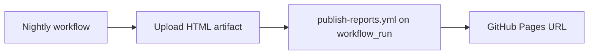

# Reporting — artifacts, GitHub Pages, Allure

How to give stakeholders and developers fast access to Playwright results.

## Report types in this repo

| Type | Generated by | Local command | CI path |
|------|--------------|---------------|---------|
| HTML | Playwright built-in | `npm run report` | `reports/html/` |
| Trace | `retain-on-failure` in CI | Trace Viewer | `test-results/**/*.zip` |
| Allure | `allure-playwright` when `ALLURE_REPORT=true` | `npm run report:allure:open` | `reports/allure-report/` |

Config: `playwright.config.ts` — `reporter` array and `trace` policy.

---

## Option A — Artifacts only (default, lowest effort)

**Best for:** PR feedback, small teams, getting started.

Already implemented in `playwright.yml`:

- On failure → upload `reports/html/` and `test-results/`
- Developer downloads artifact from Actions run → open `index.html`

### User instructions (add to README)

```markdown
### CI reports

1. Open the failed GitHub Actions run.
2. Download **playwright-html-report-pr** from Artifacts.
3. Unzip and open `index.html`.
4. For traces, download **playwright-test-results-pr** and open zip files at [trace.playwright.dev](https://trace.playwright.dev).
```

**Retention:** PR 7–14 days; nightly 30 days if using Pages elsewhere.

---

## Option B — GitHub Pages dashboard (persistent URL)

**Best for:** Nightly trends, sharing with PMs, single link in Slack.

### Prerequisites (GitHub UI)

1. **Settings → Pages → Build and deployment → Source:** GitHub Actions
2. Ensure repo Actions have `pages: write` and `id-token: write` in publish job only

### Workflow pattern

Create `.github/workflows/publish-reports.yml` (see [pipeline-patterns.md](pipeline-patterns.md)).

Flow:



### Merging matrix reports

When nightly runs a browser matrix, each leg uploads `nightly-report-<project>`. The publish job should `merge-multiple: true` or pick `chromium` as canonical dashboard.

### Custom subdirectory

If the site hosts more than reports, deploy to `reports/html` inside a `docs/` site or use `base` path in Playwright HTML config (advanced).

---

## Option C — Allure report site

**Best for:** Historical trends, severity layers, categories, attachments.

### Enable in tests

```bash
ALLURE_REPORT=true npm run test:allure
# or in CI:
env:
  ALLURE_REPORT: true
```

### CI steps

```yaml
- run: npm run test:allure
  env:
    ALLURE_REPORT: true
    CI: true

- name: Generate static Allure site
  if: always()
  run: npm run report:allure

- uses: actions/upload-pages-artifact@v3
  if: always()
  with:
    path: reports/allure-report

- uses: actions/deploy-pages@v4
  id: deployment
```

**Requirement:** Java not needed — `allure` CLI via `npx allure-commandline` if not in package.json; this repo uses `allure generate` via npm script.

### Allure in PRs

Generate but don't deploy Pages on every PR — upload artifact only:

```yaml
- uses: actions/upload-artifact@v4
  if: failure()
  with:
    name: allure-report-pr
    path: reports/allure-report/
```

---

## Option D — PR comment with report link

**Best for:** Developer UX — link directly from PR.

Patterns:

1. **Artifact link** — comment with link to Actions run artifacts (no extra permissions).
2. **Published preview** — deploy report to Pages preview branch; comment URL (needs token).
3. **Third-party** — Playwright Report Summary actions (pin and vet before use).

Minimal comment step (link to workflow run):

```yaml
- name: Comment on PR
  if: failure() && github.event_name == 'pull_request'
  uses: actions/github-script@v7
  with:
    script: |
      github.rest.issues.createComment({
        issue_number: context.issue.number,
        owner: context.repo.owner,
        repo: context.repo.repo,
        body: `### Playwright tests failed\n\n📊 [Download HTML report](${{ github.server_url }}/${{ github.repository }}/actions/runs/${{ github.run_id }}) → Artifacts`
      })
```

Requires `pull-requests: write` in job `permissions`.

---

## Comparison

| Approach | Setup | Cost | History | PR UX |
|----------|-------|------|---------|-------|
| Artifacts | ✅ Done | Free tier storage | Retention limit | Download zip |
| GitHub Pages | Medium | Free public repos | Persistent URL | Link in README |
| Allure Pages | Medium+ | Free | Rich trends | Best for leads |
| PR comment | Low | Free | None | Best for devs |

**Recommendation for this repo:**

1. Keep artifacts on PR (current).
2. Add Pages publish on nightly when user wants a dashboard.
3. Add Allure when user needs trends/categories.
4. Add PR comment when team asks for faster failure triage.

---

## Local parity with CI

```bash
CI=true CI_TIER=pr npm run test:pr
npm run report

# Allure
ALLURE_REPORT=true npm run test:smoke
npm run report:allure:open
```

Match env vars from `.env.example` and GitHub Secrets.

---

## Troubleshooting

| Symptom | Cause | Fix |
|---------|-------|-----|
| Empty `reports/html` | Tests aborted before reporter flush | `if: always()` on upload step |
| Pages 404 | Pages source not "GitHub Actions" | Fix in Settings → Pages |
| Allure empty | `ALLURE_REPORT` not set | Set env in workflow |
| Trace missing | Passed test on PR | Expected — `retain-on-failure` only |
| Artifact too large | Videos on all tests | Keep `video: retain-on-failure` in config |
