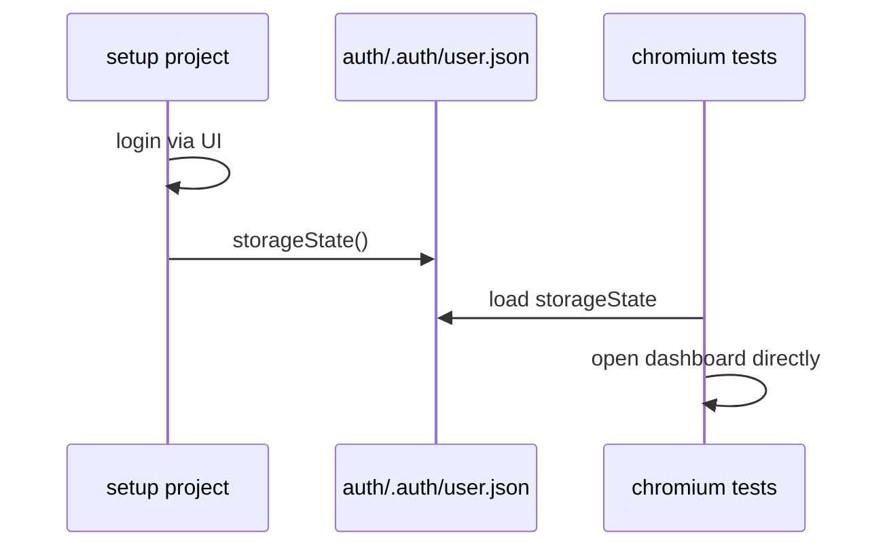

# Curriculum — Lessons 03–10

Lessons 01, 02, and 11 live in `docs/lessons/`. This file covers lessons 03–10 referenced by `docs/LEARNING.md`.

---

## Lesson 03: Fixtures

### Simple explanation

A **fixture** is named test setup that Playwright injects into your test function — like dependency injection in other frameworks.

### Why it matters

Without fixtures, every test repeats `loadConfig()`, `new LoginPage(page)`, and login boilerplate. Fixtures centralize setup so specs stay 5–10 lines.

### In this repo

Open `fixtures/index.ts`:

```typescript
export type TestFixtures = {
  config: AppConfig;
  loginPage: LoginPage;
  dashboardPage: DashboardPage;
  apiClient: ApiClient;
  // ...
};

export const test = base.extend<TestFixtures>({
  loginPage: async ({ page }, use) => {
    await use(new LoginPage(page));
  },
  // ...
});
```

Tests import `test` from `@fixtures/index`, not `@playwright/test`.

### TypeScript spotlight

- `base.extend<TestFixtures>({...})` — generic fixture map for compile-time safety.
- `async ({ page }, use) => { await use(value); }` — setup → test → teardown pattern.

### Try it

```bash
npm run test:ui
# Open tests/ui/login.spec.ts — list every fixture used in the callback
```

### Checkpoint

1. What happens if you import `test` from `@playwright/test` instead of `@fixtures/index`?
2. Which fixture provides `config.credentials.username`?
3. Why is `apiClient` created with `request` instead of `page`?

**Next:** Lesson 04 — Page Objects (`pages/LoginPage.ts`)

---

## Lesson 04: Page Object Model

### Simple explanation

A **Page Object** is a class that represents one screen. It exposes locators and actions; tests call `loginPage.login()` instead of raw `page.fill()`.

### Why it matters

When the login form changes, you update **one file** (`LoginPage.ts`), not twenty specs.

### In this repo

```typescript
// pages/BasePage.ts — shared navigation
export abstract class BasePage {
  constructor(protected readonly page: Page) {}
  async goto(path: string = ROUTES.login): Promise<void> { ... }
}

// pages/LoginPage.ts — screen-specific
export class LoginPage extends BasePage {
  readonly loginButton = page.getByRole('button', { name: 'Login' });
  async login(username: string, password: string): Promise<void> { ... }
}
```

### Rules

| Do in `pages/`                  | Do in `tests/`                |
| ------------------------------- | ----------------------------- |
| Locators, clicks, fills         | `expect()`, test data choices |
| `open()`, `login()`, `logout()` | Tags, describe blocks         |

### Try it

1. Compare `pages/LoginPage.ts` and `tests/ui/login.spec.ts`
2. Find three methods on `DashboardPage` used in `tests/ui/dashboard.spec.ts`

### Checkpoint

1. Why does `BasePage` use `protected readonly page`?
2. Where should `expect(dashboardPage.pageTitle).toHaveText(...)` live?
3. What is the difference between `open()` and `goto()`?

**Next:** Lesson 05 — Locators (`pages/DashboardPage.ts`)

---

## Lesson 05: Locator Strategy

### Simple explanation

A **locator** finds elements on the page. Good locators survive UI refactors; bad ones break when CSS changes.

### Why it matters

Flaky tests often trace back to brittle selectors. This framework prioritizes accessibility-first locators.

### Priority order (this repo)

1. `getByRole` — buttons, headings, links (what screen readers use)
2. `getByPlaceholder` / `getByLabel` — form fields
3. `getByTestId` — `data-test` attributes (see `testIdAttribute` in config)

### In this repo

```typescript
// pages/LoginPage.ts
this.loginButton = page.getByRole('button', { name: 'Login' });
this.errorMessage = page.getByTestId('error');

// playwright.config.ts
testIdAttribute: 'data-test',
```

### Good vs bad

| Bad                             | Good                                             |
| ------------------------------- | ------------------------------------------------ |
| `page.locator('#login-button')` | `page.getByRole('button', { name: 'Login' })`    |
| `div.cart > span:nth-child(2)`  | `getByTestId('add-to-cart-sauce-labs-backpack')` |
| `waitForTimeout(2000)`          | `await expect(locator).toBeVisible()`            |

### Try it

```bash
npx playwright codegen https://www.saucedemo.com
# Record locators — then rewrite the worst ones using getByRole
```

### Checkpoint

1. Why is `getByRole` preferred over CSS?
2. What attribute does `getByTestId('add-to-cart')` match on Sauce Demo?
3. What happens when a locator matches zero elements during `click()`?

**Next:** Lesson 06 — Auth (`tests/setup/auth.setup.ts`)

---

## Lesson 06: Auth with storageState

### Simple explanation

**storageState** saves cookies and localStorage to a JSON file after login. Later tests load that file and start already authenticated — no login form.

### Why it matters

Logging in through the UI for every test adds ~2s × N tests. Setup project runs login **once**; all UI tests reuse the session.

### Flow



### In this repo

```typescript
// tests/setup/auth.setup.ts
await page.context().storageState({ path: AUTH_STORAGE_PATH });

// fixtures/authenticated.fixture.ts
export const authenticatedTest = base.extend({
  storageState: AUTH_STORAGE_PATH,
});
```

```typescript
// tests/ui/authenticated.spec.ts
import { authenticatedTest as test } from '@fixtures/authenticated.fixture';

test('should access dashboard...', async ({ dashboardPage }) => {
  await dashboardPage.open(); // no loginPage.login() needed
});
```

### Try it

```bash
npm run test:ui
# Compare tests/ui/login.spec.ts (full login) vs authenticated.spec.ts (storageState)
```

### Checkpoint

1. Which Playwright project runs `auth.setup.ts`?
2. Why do `login.spec.ts` tests still use the base `test` fixture?
3. What file path holds the saved session? (see `utils/constants.ts`)

**Next:** Lesson 07 — API contracts (`tests/api/users-get.spec.ts`)

---

## Lesson 07: API Contract Tests

### Simple explanation

An **API contract test** calls a real HTTP endpoint and verifies the response shape matches what the app expects — status code, JSON structure, key fields.

### Why it matters

APIs change silently. Contract tests catch breaking changes before UI tests fail mysteriously.

### In this repo

```typescript
// tests/api/users-get.spec.ts
const users = await apiClient.getValidated(API_ENDPOINTS.users, ApiUsersSchema, 200);
expect(users.length).toBeGreaterThan(0);
expect(users[0]?.email).toContain('@');
```

`getValidated` checks status **and** parses JSON through Zod.

For negative tests:

```typescript
const result = await apiClient.getResult('/users/99999/nonexistent');
expectApiFailure(result);
```

### Layers

| Method         | When                                         |
| -------------- | -------------------------------------------- |
| `getValidated` | Happy path — throws on bad status or schema  |
| `getResult`    | Negative path — returns `{ ok: false, ... }` |
| `getRaw`       | Custom assertions on raw response            |

### Try it

```bash
npm run test:api
# Read utils/api-client.ts — trace getValidated from call to Zod parse
```

### Checkpoint

1. Why does the `api` project have no `dependencies: ['setup']`?
2. What exception type is thrown when Zod validation fails?
3. When would you use `getResult` instead of `getValidated`?

**Next:** Lesson 08 — Zod + TypeScript (`schemas/api.schemas.ts`)

---

## Lesson 08: Zod + TypeScript

### Simple explanation

**Zod** validates unknown JSON at runtime. **TypeScript** checks types at compile time. This framework uses one Zod schema for both via `z.infer`.

### Why it matters

TypeScript cannot validate API responses at runtime. Zod closes that gap — a typo in production JSON is caught in tests.

### In this repo

```typescript
// schemas/api.schemas.ts
export const ApiUserSchema = z.object({
  id: z.number().int().positive(),
  email: z.string().email(),
  // ...
});
export type ApiUser = z.infer<typeof ApiUserSchema>;
```

```typescript
// utils/api-client.ts
const result = schema.safeParse(parsed);
if (!result.success) {
  throw new ApiValidationError(url, status, result.error, parsed);
}
return result.data; // typed as z.infer<S>
```

### Also validated

- `schemas/config.schemas.ts` — env / config loading
- `schemas/test-data.schemas.ts` — JSON fixtures in `test-data/`

### Try it

```bash
npm run test:unit
# tests/unit/config-and-schemas.spec.ts exercises schema edge cases
```

### Checkpoint

1. What is the difference between `schema.parse()` and `schema.safeParse()`?
2. Why export `type ApiUser = z.infer<typeof ApiUserSchema>` alongside the schema?
3. Where is config validated at startup? (`utils/config-loader.ts`)

**Next:** Lesson 09 — CI tiers and tags

---

## Lesson 09: CI Tiers and Tags

### Simple explanation

**Tags** label tests (`@smoke`, `@regression`, `@mock`). **CI tiers** decide which tags run on PR vs nightly — fast feedback on every commit, full coverage overnight.

### Why it matters

Running 50 browser tests on every PR slows teams down. This framework runs unit + api + smoke on PR (< 5 min); regression runs nightly.

### In this repo

```typescript
test('should login...', { tag: ['@smoke', '@regression'] }, async () => { ... });
```

```json
"test:pr": "playwright test --project=unit && playwright test --project=api && playwright test --project=chromium --grep @smoke",
"test:regression": "playwright test --grep @regression",
"test:mock": "playwright test --grep @mock --project=api-mock --project=chromium-mock"
```

```typescript
// playwright.config.ts
retries: isNightly ? 1 : 0,  // PR: zero retries — fix flakes, don't mask
forbidOnly: isCi,
```

### Tag guide

| Tag           | Meaning                      | Typical tier        |
| ------------- | ---------------------------- | ------------------- |
| `@smoke`      | Critical path                | PR                  |
| `@regression` | Broader coverage             | Nightly             |
| `@mock`       | Needs MSW/Docker/route mocks | On demand / nightly |

### Try it

```bash
npm run test:pr        # simulate CI
time npm run test:smoke
time npm run test:regression
```

### Checkpoint

1. How many stages does `test:pr` run, and in what order?
2. Why are mock tests tagged `@mock` instead of running on every PR?
3. What happens if you commit `test.only` to CI?

**Next:** Lesson 10 — Debugging

---

## Lesson 10: Debugging Failures

### Simple explanation

When a test fails, Playwright captures **traces**, **screenshots**, and **videos**. Your job: find the failing step in under 30 seconds.

### Why it matters

Re-running tests blindly wastes time. Traces show exact DOM state, network calls, and console errors at each step.

### In this repo

```typescript
// playwright.config.ts
trace: isCi ? 'retain-on-failure' : 'on-first-retry',
screenshot: 'only-on-failure',
video: 'retain-on-failure',
```

```typescript
// fixtures/index.ts — page fixture logs console errors
page.on('console', (message) => {
  if (message.type() === 'error') {
    logger.warn('Browser console error', { text: message.text() });
  }
});
```

### Debug workflow

1. **Read the error message** — locator timeout? assertion? navigation?
2. **Open HTML report** — `npm run report`
3. **Open trace** — click the failed step → see DOM snapshot, network, source
4. **Classify** — locator issue / timing / data / real app bug
5. **Fix root cause** — never only increase timeout

### Commands

```bash
npm run test:debug              # Playwright Inspector — step through
npx playwright test --trace on  # always record trace
npx playwright test --repeat-each=20  # reproduce flakes
```

### Try it

1. Intentionally break a locator in `LoginPage.ts` locally
2. Run `npm run test:ui`, open report, walk the trace
3. Revert the change

### Checkpoint

1. What is the difference between `retain-on-failure` and `on-first-retry` for traces?
2. Where do browser console errors appear in this framework?
3. What command helps reproduce intermittent failures?

**Next:** [Lesson 11 — Mocking Strategies](../../docs/lessons/11-mocking-strategies.md)

---

## Self-assessment (after Lesson 11)

After completing all lessons, you should be able to:

- [ ] Draw the 8 Playwright projects from memory
- [ ] Explain when to use `test` vs `authenticatedTest` vs `mswTest`
- [ ] Write a Page Object with role/testId locators
- [ ] Write an API test with `getValidated` + Zod
- [ ] Choose MSW vs Testcontainers vs `page.route`
- [ ] Tag a test and run the matching CI tier locally
- [ ] Read a trace and find the failing step in under 30 seconds
