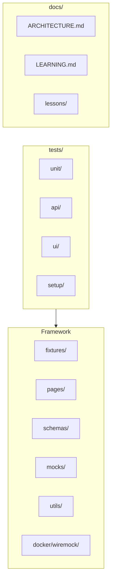

# Playwright Learning — Cursor Agent Guide

Production-ready Playwright TypeScript framework. Use this file as the project brief when working here.

## Agent mode

| Mode | When | Invoke |
|------|------|--------|
| **Senior SDET** | Tests, coverage, flakiness, framework, CI | `@.cursor/skills/senior-sdet/SKILL.md` |

## Documentation (read first)

| Doc | Purpose |
|-----|---------|
| [docs/README.md](docs/README.md) | Documentation hub |
| [docs/ARCHITECTURE.md](docs/ARCHITECTURE.md) | **Diagrams & system design** |
| [docs/LEARNING.md](docs/LEARNING.md) | Curriculum index |
| [README.md](README.md) | Quick start |

## Repository layout



## Playwright projects (8 total)

| Project | Purpose |
|---------|---------|
| `unit` | Framework unit tests |
| `api` | Live API contracts |
| `api-mock` | MSW + Testcontainers |
| `setup` | Auth storageState |
| `chromium` / `firefox` / `webkit` | UI E2E |
| `chromium-mock` | `page.route` UI mocks |

## Key commands

```bash
npm run test:pr           # CI PR tier
npm run test:mock           # MSW + Docker + page.route
npm run test:smoke          # @smoke
npm run test:regression     # @regression
npm run validate            # typecheck + lint + format
```

## Senior SDET focus

- Pyramid: unit → api → ui
- Contracts: Zod for API, env, test data
- Mocking: MSW (`fetch`) · Testcontainers (`request`) · `page.route` (browser)
- Reliability: retries 0 on PR, no sleep waits
- CI: fast PR, full nightly

## Skills

| Skill | Path |
|-------|------|
| Senior SDET | `.cursor/skills/senior-sdet/SKILL.md` |
| Playwright patterns | `.cursor/skills/senior-sdet/playwright-patterns.md` |

## Safety

- Never commit `.env`, credentials, or `auth/.auth/`
- Use `.env.example` for templates only
