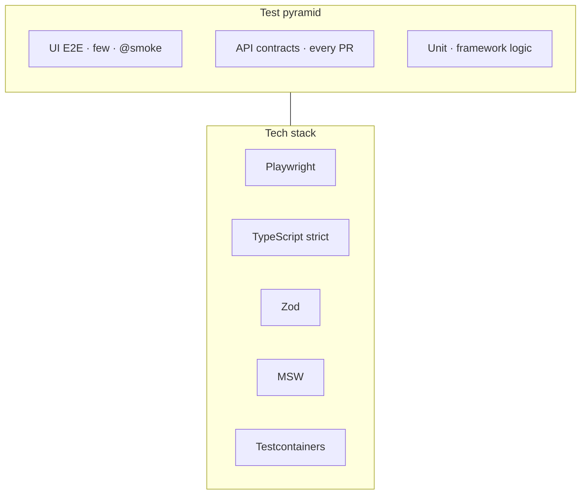
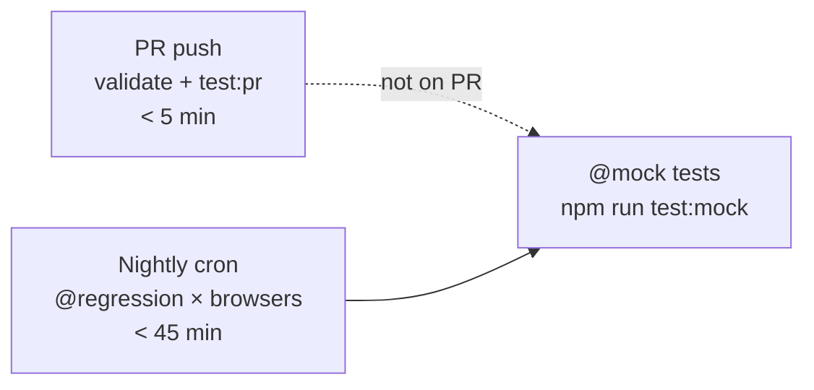

# Playwright TypeScript Test Automation Framework

Enterprise-grade Playwright framework with Page Object Model, Zod contracts, typed fixtures, tiered CI, API mocking, and a structured learning path.

---

## Documentation

| Doc | What's inside |
|-----|---------------|
| [**docs/ARCHITECTURE.md**](docs/ARCHITECTURE.md) | Layered diagrams, project graph, mocking, CI pipeline |
| [**docs/LEARNING.md**](docs/LEARNING.md) | Hands-on curriculum — start here to learn |
| [**docs/README.md**](docs/README.md) | Documentation hub & navigation |
| [**AGENTS.md**](AGENTS.md) | Cursor agent onboarding |

---

## Quick start

```bash
npm install
npx playwright install
cp .env.example .env.dev
npm run test:pr        # CI PR tier — ~10s
```

---

## Architecture snapshot



---

## Running tests

| Command | What runs | When to use |
|---------|-----------|-------------|
| `npm run test:pr` | unit + api + `@smoke` | Before every push |
| `npm run test:smoke` | Critical path | Quick confidence |
| `npm run test:regression` | Full `@regression` | Pre-release |
| `npm run test:mock` | MSW + Docker + `page.route` | Mocking work |
| `npm run test:unit` | Framework unit tests | After utils changes |
| `npm run test:api` | Live API contracts | After API client changes |
| `npm run test:ui` | UI E2E chromium | After page object changes |
| `npm run validate` | typecheck + lint + format | Quality gate |

---

## Project structure

```
playwright-learning/
├── docs/                      # Architecture, learning, diagrams
├── schemas/                   # Zod — single source of truth
├── mocks/                     # MSW handlers
├── docker/wiremock/           # Testcontainers stub mappings
├── fixtures/                  # Typed DI layers (base, auth, msw, container)
├── pages/                     # Page Objects
├── builders/                  # Fluent test data
├── types/                     # Branded types, unions
├── utils/                     # API clients, config, route mocks
├── tests/
│   ├── unit/                  # No browser
│   ├── api/                   # HTTP contracts + mocks
│   ├── ui/                    # Browser E2E
│   └── setup/                 # Auth storageState
└── .github/workflows/         # PR + nightly
```

---

## Demo targets

| Layer | Target | Project |
|-------|--------|---------|
| Unit | Framework code | `unit` |
| API | [JSONPlaceholder](https://jsonplaceholder.typicode.com) | `api` |
| API mocks | MSW + WireMock Docker | `api-mock` |
| UI | [Sauce Demo](https://www.saucedemo.com) | `chromium` / `firefox` / `webkit` |

---

## CI tiers



---

## Code patterns

```typescript
// API contract (live)
const users = await apiClient.getValidated(API_ENDPOINTS.users, ApiUsersSchema);

// Authenticated UI
import { authenticatedTest as test } from '@fixtures/authenticated.fixture';

// CI tiering
test('...', { tag: ['@smoke', '@regression'] }, async () => { ... });
```

---

## Learn

Open **[docs/LEARNING.md](docs/LEARNING.md)** or ask the agent:

> "Teach me Lesson 01"

---

## License

Private — learning / internal use.
