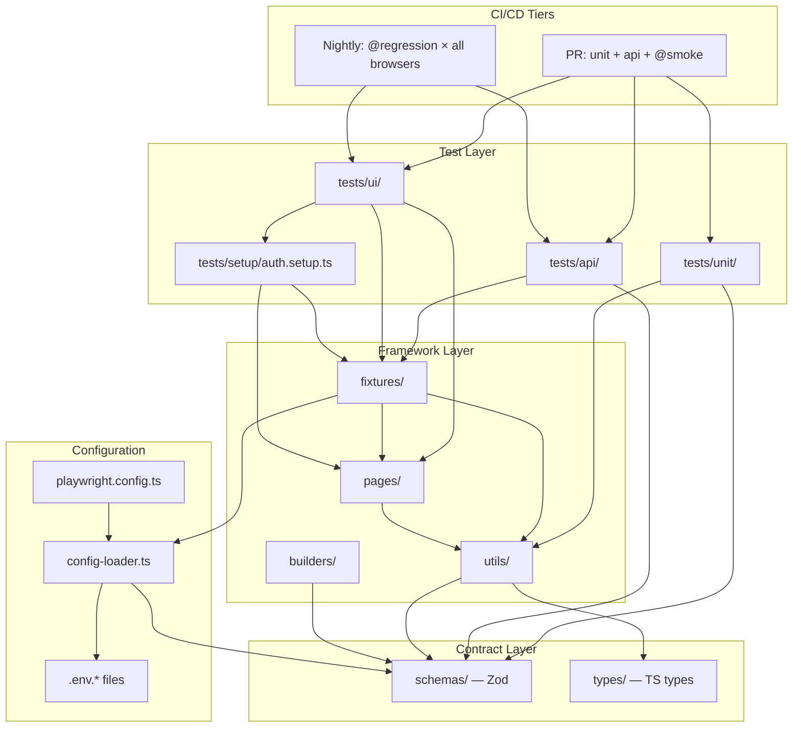
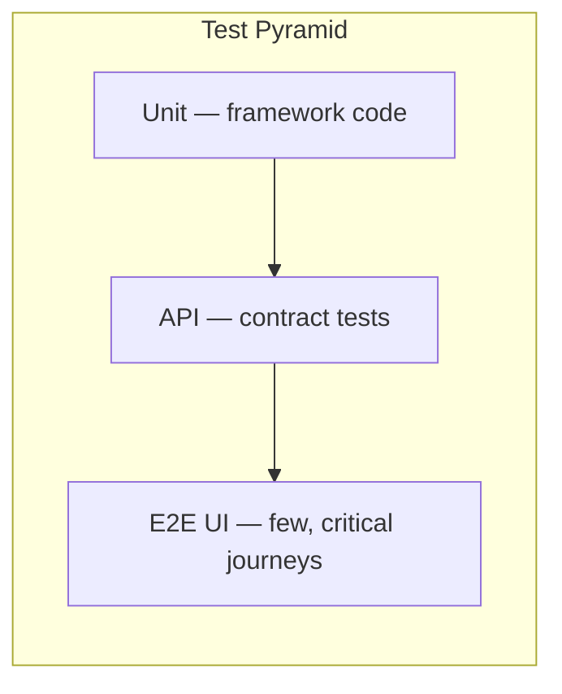
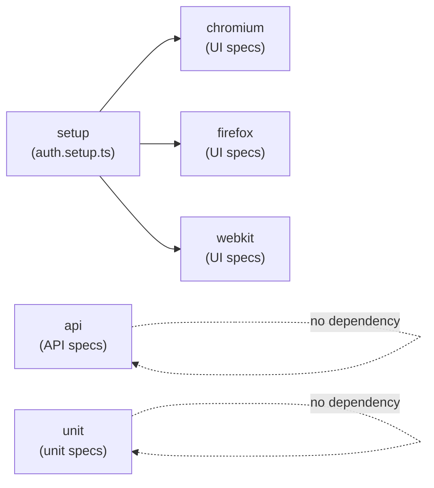
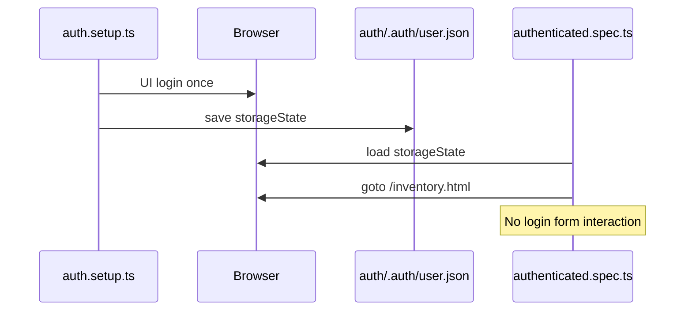
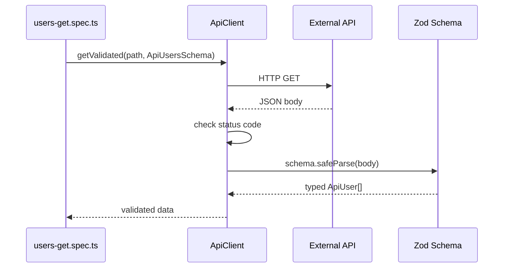

# Framework Architecture

Production-grade Playwright + TypeScript test automation framework. This document explains how layers connect and why each exists.

## High-level diagram



## Test pyramid (enforced)



| Layer    | Location       | Playwright project                | Browser?            |
| -------- | -------------- | --------------------------------- | ------------------- |
| Unit     | `tests/unit/`  | `unit`                            | No                  |
| API      | `tests/api/`   | `api`                             | No (uses `request`) |
| UI setup | `tests/setup/` | `setup`                           | Yes (once)          |
| UI E2E   | `tests/ui/`    | `chromium` / `firefox` / `webkit` | Yes                 |

## Playwright projects



**Key design decision:** API and unit tests do **not** depend on browser auth setup. This keeps PR runs fast and layers decoupled.

## Authentication flow



## Data flow (API contract test)



## Folder responsibilities

| Folder         | Responsibility                                            |
| -------------- | --------------------------------------------------------- |
| `tests/unit/`  | Framework logic — config, schemas, builders, URL builder  |
| `tests/api/`   | HTTP contract tests — status + Zod schema + key fields    |
| `tests/ui/`    | Browser E2E — user journeys                               |
| `tests/setup/` | One-time auth, saves `storageState`                       |
| `pages/`       | Page Objects — locators + actions only (no assertions)    |
| `fixtures/`    | Dependency injection — pages, config, apiClient           |
| `schemas/`     | **Single source of truth** — Zod schemas, `z.infer` types |
| `types/`       | TS-only types — branded IDs, unions, utility types        |
| `builders/`    | Fluent test data builders                                 |
| `utils/`       | Config loader, API client, logger, constants, tags        |
| `test-data/`   | Static JSON — validated at load time via Zod              |

## CI tiers

| Tier       | Trigger        | Command                           | Target time |
| ---------- | -------------- | --------------------------------- | ----------- |
| PR         | push / PR      | `npm run test:pr`                 | < 5 min     |
| Nightly    | cron 02:00 UTC | `--grep @regression` all projects | < 45 min    |
| Local full | manual         | `npm test`                        | varies      |

### Test tags

| Tag           | Purpose                                       |
| ------------- | --------------------------------------------- |
| `@smoke`      | Critical path — runs on every PR              |
| `@regression` | Full coverage — runs nightly                  |
| `@quarantine` | Flaky / under investigation — exclude from PR |

## Locator strategy

Priority order (enforced in page objects):

1. `getByRole` / `getByLabel` / `getByPlaceholder`
2. `getByTestId` — `data-test` attributes
3. CSS — only when no semantic alternative (document why)

## Adding a new test (decision tree)

```
New test needed?
├── Pure logic / schema / config?     → tests/unit/
├── HTTP endpoint contract?           → tests/api/ + Zod schema
└── User journey in browser?
    ├── Needs login?
    │   ├── Testing login itself?     → tests/ui/ + base fixture
    │   └── Already logged in?        → authenticatedTest fixture
    └── Tag with @smoke or @regression
```

## Error taxonomy (API layer)

| Error class          | When thrown                |
| -------------------- | -------------------------- |
| `ApiRequestError`    | HTTP status ≠ expected     |
| `ApiValidationError` | Zod schema mismatch        |
| `ApiParseError`      | Response is not valid JSON |

## Reliability policies

- **CI retries:** `0` on PR (`retries: 0`)
- **Nightly retries:** `1` max (`CI_TIER=nightly`)
- **Trace:** `on-failure` in CI, `on-first-retry` locally
- **Parallel data:** `uniqueSuffix()` includes `TEST_PARALLEL_INDEX`
- **No `waitForTimeout`** — use Playwright auto-wait + `expect`

## Extension points

| Need              | Where to extend                                               |
| ----------------- | ------------------------------------------------------------- |
| New API entity    | `schemas/api.schemas.ts` → `ApiClient` methods                |
| New page          | `pages/NewPage.ts` → register in `fixtures/index.ts`          |
| New env           | Add to `ENVIRONMENTS` + `.env.{name}`                         |
| New fixture layer | `fixtures/*.fixture.ts` extending base with typed composition |
| OpenAPI contracts | Generate types → align Zod schemas                            |
