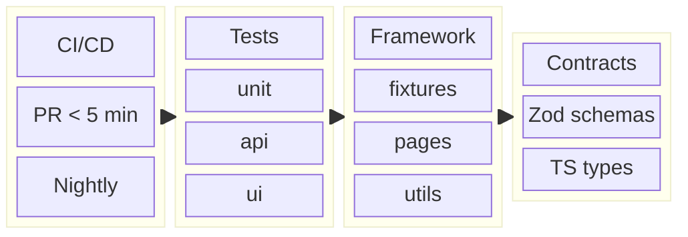
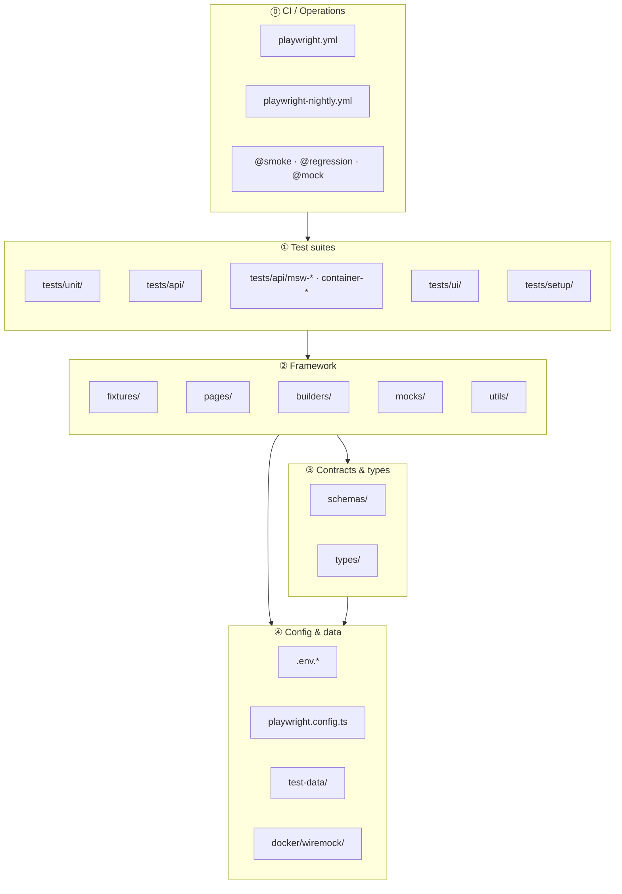
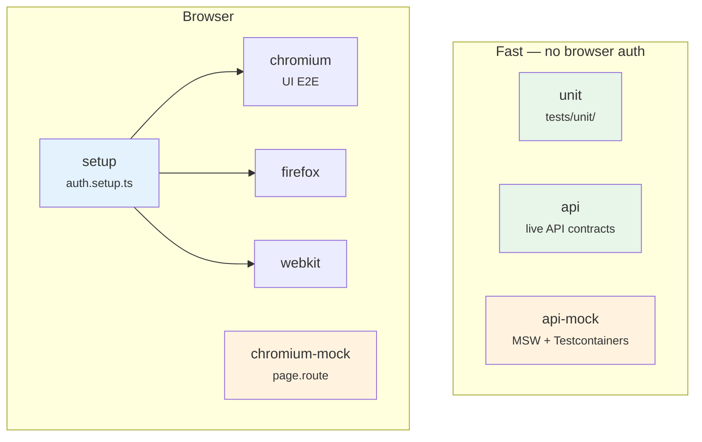
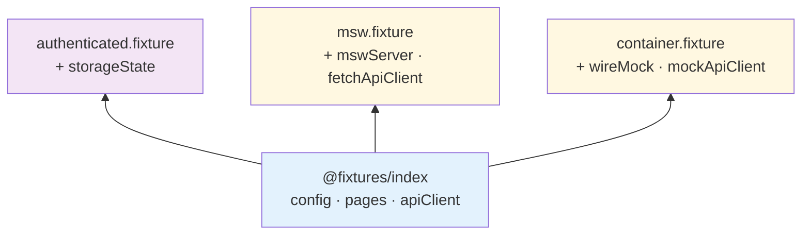
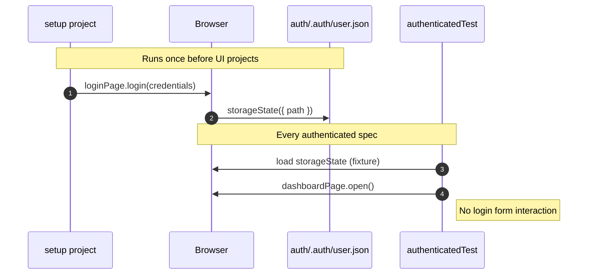
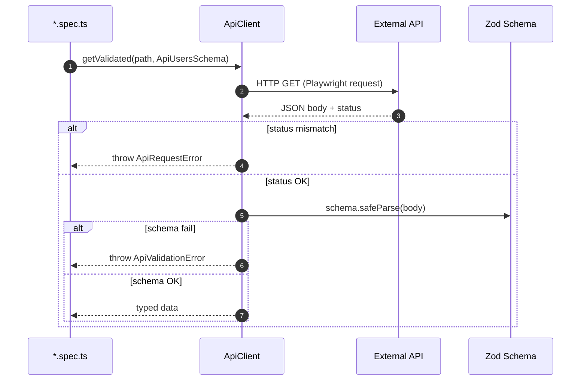
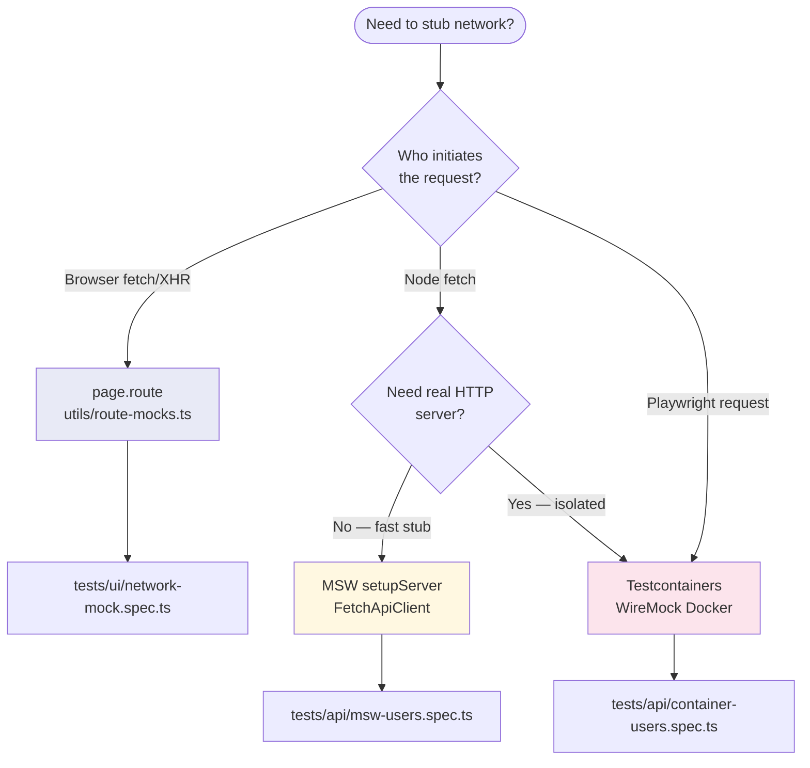
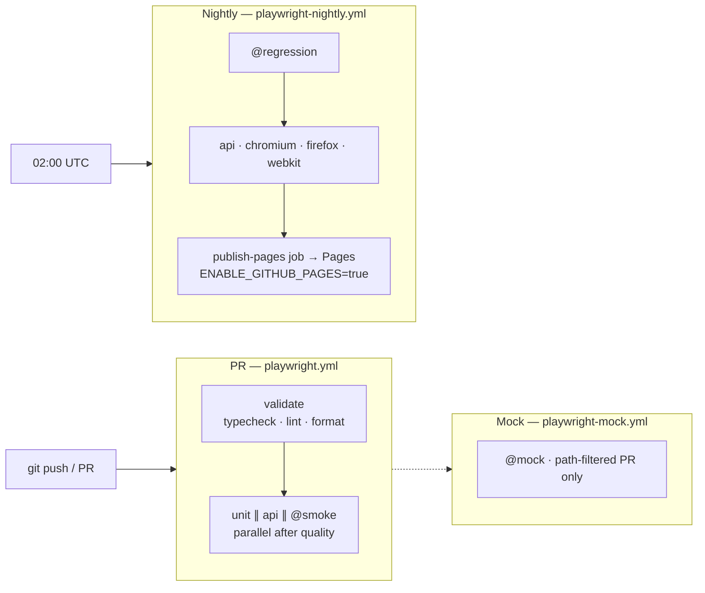
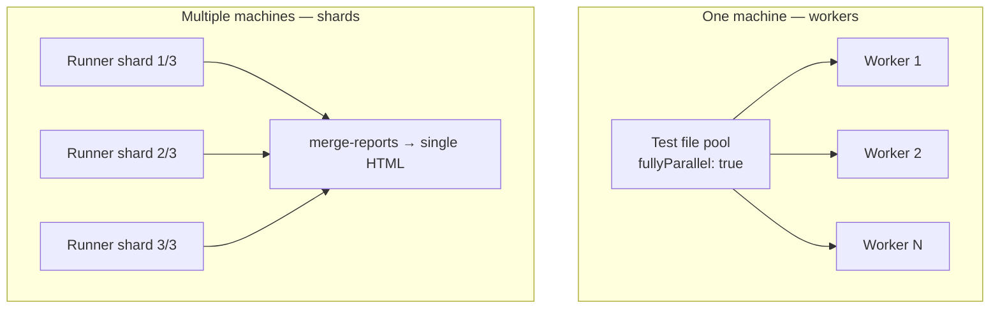
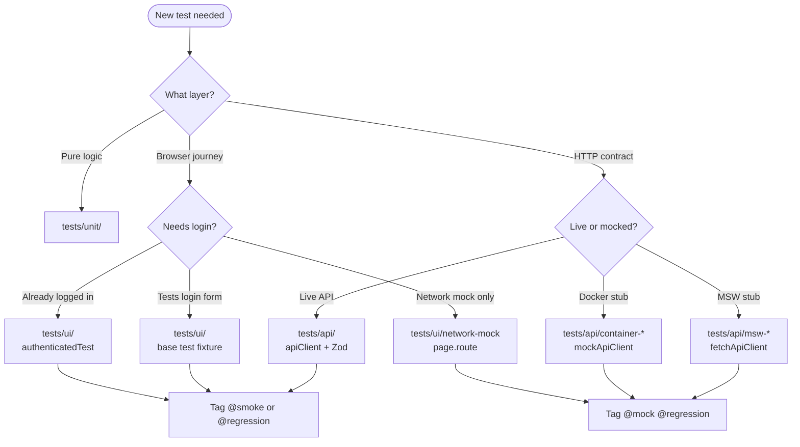

# Framework Architecture

Production-grade Playwright + TypeScript automation framework. This document is the **single source of truth** for system design, data flows, and visual architecture.

---

## At a glance



| Principle        | Implementation                                |
| ---------------- | --------------------------------------------- |
| Test pyramid     | `unit` → `api` → `ui`                         |
| Fast PR feedback | `test:pr` — unit + api + `@smoke`             |
| Contract safety  | Zod validates API, env, and JSON fixtures     |
| Auth efficiency  | `storageState` — login once, reuse everywhere |
| No flake masking | `retries: 0` on PR                            |
| Mocking by layer | MSW · Testcontainers · `page.route`           |

---

## Diagram index

| #   | Diagram                                         | Section              |
| --- | ----------------------------------------------- | -------------------- |
| 1   | [Layered architecture](#1-layered-architecture) | System layers        |
| 2   | [Playwright projects](#2-playwright-projects)   | Project graph        |
| 3   | [Fixture composition](#3-fixture-composition)   | Fixture layers       |
| 4   | [Authentication flow](#4-authentication-flow)   | storageState         |
| 5   | [API contract flow](#5-api-contract-flow)       | Zod validation       |
| 6   | [Mocking strategies](#6-mocking-strategies)     | MSW / Docker / route |
| 7   | [CI pipeline](#7-ci-pipeline)                   | PR vs nightly        |
| 8   | [Test decision tree](#8-test-decision-tree)     | Where to add tests   |

---

## 1. Layered architecture



### Folder responsibilities

| Folder             | Owns                             | Does not own                                           |
| ------------------ | -------------------------------- | ------------------------------------------------------ |
| `tests/`           | Specs, assertions, test intent   | Locator logic, HTTP client code                        |
| `fixtures/`        | Dependency injection, lifecycle  | Business assertions                                    |
| `pages/`           | Locators + user actions          | Assertions                                             |
| `schemas/`         | Runtime + compile-time contracts | Test scenarios                                         |
| `mocks/`           | MSW handlers + mock payloads     | Real API calls                                         |
| `utils/`           | Config, clients, helpers, tags   | Page-specific locators                                 |
| `docker/wiremock/` | HTTP stub mappings               | Container orchestration (in `utils/testcontainers.ts`) |

---

## 2. Playwright projects

Eight projects. Each has a single responsibility.



| Project              | `testMatch`                        | Depends on | Browser | Typical runtime |
| -------------------- | ---------------------------------- | ---------- | ------- | --------------- |
| `unit`               | `tests/unit/**`                    | —          | No      | ~2s             |
| `api`                | `tests/api/**` (excl. mock)        | —          | No\*    | ~2s             |
| `api-mock`           | `msw-*`, `container-*`             | —          | No\*    | ~5–40s          |
| `setup`              | `auth.setup.ts`                    | —          | Yes     | ~2s             |
| `chromium`           | `tests/ui/**` (excl. network-mock) | `setup`    | Yes     | ~5s             |
| `chromium-mock`      | `network-mock.spec.ts`             | —          | Yes     | ~2s             |
| `firefox` / `webkit` | `tests/ui/**`                      | `setup`    | Yes     | nightly         |

\*Uses Playwright `request` or Node `fetch` — no browser window.

---

## 3. Fixture composition

Fixtures are **typed dependency injection layers**. Each layer extends the one below.



| Fixture import                    | Use when                                   |
| --------------------------------- | ------------------------------------------ |
| `@fixtures/index`                 | Default UI/API tests                       |
| `@fixtures/authenticated.fixture` | UI tests that need login (skip login form) |
| `@fixtures/msw.fixture`           | API tests with MSW + `fetch`               |
| `@fixtures/container.fixture`     | API tests against WireMock Docker          |

```typescript
// Typed composition example
export type AuthenticatedFixtures = TestFixtures & { storageState: string };
```

---

## 4. Authentication flow

Login runs **once** per test run. Authenticated specs reuse `storageState`.



| Spec type                | Auth approach                           |
| ------------------------ | --------------------------------------- |
| `login.spec.ts`          | Full UI login (tests the login journey) |
| `dashboard.spec.ts`      | `authenticatedTest`                     |
| `authenticated.spec.ts`  | `authenticatedTest`                     |
| `negative-login.spec.ts` | No auth (guest)                         |

---

## 5. API contract flow

Every live API test validates **status + schema + key fields**.



### Error taxonomy

| Error                | Trigger                |
| -------------------- | ---------------------- |
| `ApiRequestError`    | HTTP status ≠ expected |
| `ApiValidationError` | Zod contract mismatch  |
| `ApiParseError`      | Body is not valid JSON |

---

## 6. Mocking strategies

Three tools. **Pick by test layer** — not by preference.



| Strategy           | Client           | Intercepts             | Requires Docker |
| ------------------ | ---------------- | ---------------------- | --------------- |
| **MSW**            | `FetchApiClient` | Node `fetch`           | No              |
| **Testcontainers** | `ApiClient`      | Real HTTP to container | Yes             |
| **page.route**     | Browser `fetch`  | Browser network        | No              |

> **Critical:** MSW does **not** patch Playwright's `request` fixture. Use `fetchApiClient` for MSW, or WireMock for `apiClient`.

```bash
npm run test:mock                              # all @mock tests
SKIP_DOCKER_TESTS=true npm run test:mock       # MSW + page.route only
```

---

## 7. CI pipeline



### Test tags

| Tag           | Runs on PR       | Runs nightly | Purpose                     |
| ------------- | ---------------- | ------------ | --------------------------- |
| `@smoke`      | Yes              | Yes          | Critical path               |
| `@regression` | No               | Yes          | Full coverage               |
| `@mock`       | Path-filtered PR | No           | MSW, Docker, page.route     |
| `@quarantine` | No               | No           | Flaky — under investigation |

Run `@mock` locally with `npm run test:mock` or via `playwright-mock.yml` on PRs that touch mock paths.

### Parallelism and sharding

Playwright uses two complementary strategies to run tests faster:



| Concept           | What it splits                                | Config / flag                                      | This repo                                         |
| ----------------- | --------------------------------------------- | -------------------------------------------------- | ------------------------------------------------- |
| **Workers**       | Tests across CPU cores on **one** runner      | `workers` in `playwright.config.ts`, `--workers=N` | `2` in CI; local default = CPU cores              |
| **fullyParallel** | Tests **within** a file run concurrently      | `fullyParallel: true`                              | Enabled globally                                  |
| **Sharding**      | Test **files** across **multiple** CI runners | `--shard=i/N`                                      | Nightly browsers (`shard_total` input)            |
| **CI job matrix** | Whole projects in parallel                    | GitHub `strategy.matrix`                           | PR: unit ∥ api ∥ smoke; Nightly: api + 3 browsers |

**Workers (in-process parallelism)**

```bash
# Local: use all cores (default) or cap workers
PLAYWRIGHT_WORKERS=4 npm run test:ui

# CLI override
npx playwright test --project=chromium --workers=4
```

`playwright.config.ts` sets `workers: 2` when `CI=true`. Override with `PLAYWRIGHT_WORKERS`.

**Sharding (cross-runner parallelism)**

Each shard runs a disjoint subset of test **files**. Playwright assigns files round-robin:

```bash
# Simulate CI shard 1 of 2 locally
npm run test:shard:regression -- --project=chromium --shard=1/2

# Shard 2 of 2 (different files)
npm run test:shard:regression -- --project=chromium --shard=2/2
```

Nightly workflow (`playwright-nightly.yml`):

1. `build-matrix` — generates `api` (1/1) + browser projects × `shard_total`
2. Each shard runs with `PLAYWRIGHT_BLOB_REPORT=true` (blob reporter)
3. `merge-reports` job downloads all blobs → `npx playwright merge-reports` → `nightly-report-merged` artifact

**Parallel-safe test data**

When multiple workers create data, use worker-scoped unique values:

```typescript
import { uniqueSuffix } from '@utils/test-data-factory';

postBuilder().withUniqueTitle('regression-post').build();
// → "regression-post-w2-1718…-a1b2c3"
```

`uniqueSuffix()` reads `TEST_PARALLEL_INDEX` (Playwright worker index) to avoid collisions.

### Reliability policies

| Policy          | Value                                    |
| --------------- | ---------------------------------------- |
| PR retries      | `0`                                      |
| Nightly retries | `1` max                                  |
| CI trace        | `retain-on-failure`                      |
| Parallel data   | `uniqueSuffix()` includes worker index   |
| Sleeps          | **Forbidden** — use auto-wait + `expect` |

---

## 8. Test decision tree



---

## Locator strategy

Sauce Demo uses `data-test` attributes — configured via `testIdAttribute: 'data-test'`.

| Priority | Method                     | Example                                   |
| -------- | -------------------------- | ----------------------------------------- |
| 1        | Role / label / placeholder | `getByRole('button', { name: 'Login' })`  |
| 2        | Test ID                    | `getByTestId('shopping-cart-badge')`      |
| 3        | CSS (document why)         | `.bm-menu-wrap` — third-party burger menu |

---

## Extension points

| Need              | Where                                              |
| ----------------- | -------------------------------------------------- |
| New API entity    | `schemas/api.schemas.ts` → `ApiClient` methods     |
| New page          | `pages/NewPage.ts` → `fixtures/index.ts`           |
| New environment   | `ENVIRONMENTS` + `.env.{name}`                     |
| New fixture layer | `fixtures/*.fixture.ts` with typed composition     |
| New mock handler  | `mocks/handlers.ts` or `docker/wiremock/mappings/` |
| OpenAPI contracts | Generate types → align Zod schemas                 |

---

## Related docs

- [LEARNING.md](./LEARNING.md) — hands-on curriculum
- [lessons/11-mocking-strategies.md](./lessons/11-mocking-strategies.md) — mocking deep dive
- [../README.md](../README.md) — quick start
