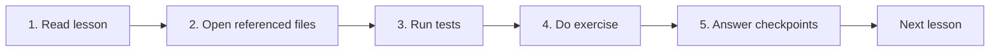
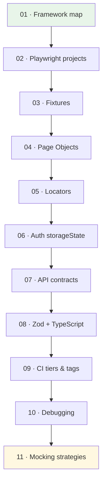

# Learning Path

Hands-on curriculum for **Playwright + TypeScript SDET** skills — every lesson maps to real code in this repository.

---

## How to learn

Ask the agent at any step: *"Teach me Lesson 03"* or *"Review my checkpoint answers"*.

---

## Curriculum map

---

## Lesson index

| # | Topic | Key files | Command |
|---|-------|-----------|---------|
| 01 | [Framework map](./lessons/01-framework-map.md) | `docs/ARCHITECTURE.md` | `npm test` |
| 02 | [Playwright projects](./lessons/02-playwright-projects.md) | `playwright.config.ts` | `npm run test:api` |
| 03 | Fixtures | `fixtures/index.ts` | `npm run test:ui` |
| 04 | Page Object Model | `pages/BasePage.ts` | `npm run test:ui` |
| 05 | Locator strategy | `pages/DashboardPage.ts` | `npm run test:ui` |
| 06 | Auth optimization | `fixtures/authenticated.fixture.ts` | `npm run test:ui` |
| 07 | API contracts | `utils/api-client.ts` | `npm run test:api` |
| 08 | Zod + TypeScript | `schemas/`, `types/` | `npm run test:unit` |
| 09 | CI tiers & tags | `.github/workflows/` | `npm run test:pr` |
| 10 | Debugging | `playwright.config.ts` | `npm run test:debug` |
| 11 | [Mocking strategies](./lessons/11-mocking-strategies.md) | `mocks/`, `utils/route-mocks.ts` | `npm run test:mock` |

Lessons **03–10** — ask the agent: *"Teach me Lesson N"*.

---

## Commands cheat sheet

| Goal | Command |
|------|---------|
| Simulate CI PR | `npm run test:pr` |
| Smoke only | `npm run test:smoke` |
| Full regression | `npm run test:regression` |
| Mocking suite | `npm run test:mock` |
| By layer | `npm run test:unit` / `test:api` / `test:ui` |
| Debug | `npm run test:debug` |
| Report | `npm run report` |
| Quality gate | `npm run validate` |

---

## Self-assessment

After completing the curriculum, you should be able to:

- [ ] Draw the 8 Playwright projects from memory
- [ ] Explain when to use `test` vs `authenticatedTest` vs `mswTest`
- [ ] Write a Page Object with role/testId locators
- [ ] Write an API test with `getValidated` + Zod
- [ ] Choose MSW vs Testcontainers vs `page.route`
- [ ] Tag a test and run the matching CI tier locally
- [ ] Read a trace and find the failing step in under 30 seconds

---

## Start

Open **[Lesson 01 — Framework Map](./lessons/01-framework-map.md)** or say:

> "Teach me Lesson 01"
