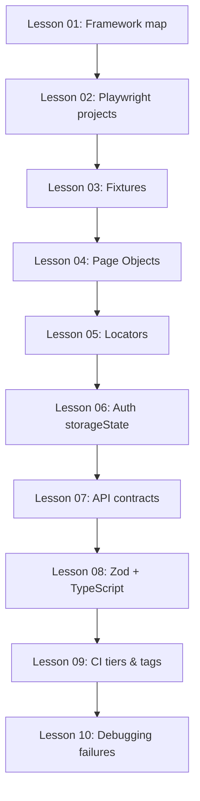

# Learning Path — Playwright + TypeScript SDET

Hands-on curriculum using **this repository**. Work through lessons in order; each maps to real files here.

## How to use this guide

1. Read the lesson topic in `docs/lessons/` (start with Lesson 01)
2. Open the referenced files in the repo
3. Run the related tests locally
4. Complete the mini exercise
5. Answer checkpoint questions (self-check or ask the Senior SDET agent)

## Recommended order



## Quick commands per lesson

```bash
# Lesson 01 — run everything
npm test

# Lesson 02 — run by project layer
npm run test:unit
npm run test:api
npm run test:ui

# Lesson 09 — run by CI tier
npm run test:smoke      # PR tier
npm run test:regression # Nightly tier
npm run test:pr         # Simulates CI PR pipeline

# Lesson 10 — debug
npm run test:headed
npm run test:debug
npm run report
```

## Lesson index

| #   | Topic                  | Key files                                                        | Run                  |
| --- | ---------------------- | ---------------------------------------------------------------- | -------------------- |
| 01  | Framework architecture | `docs/ARCHITECTURE.md`                                           | `npm test`           |
| 02  | Playwright projects    | `playwright.config.ts`                                           | `npm run test:api`   |
| 03  | Custom fixtures        | `fixtures/index.ts`                                              | `npm run test:ui`    |
| 04  | Page Object Model      | `pages/BasePage.ts`, `pages/LoginPage.ts`                        | `npm run test:ui`    |
| 05  | Locator strategy       | `pages/DashboardPage.ts`                                         | `npm run test:ui`    |
| 06  | Auth optimization      | `tests/setup/auth.setup.ts`, `fixtures/authenticated.fixture.ts` | `npm run test:ui`    |
| 07  | API client & contracts | `utils/api-client.ts`, `schemas/api.schemas.ts`                  | `npm run test:api`   |
| 08  | TypeScript patterns    | `types/branded.types.ts`, `builders/post.builder.ts`             | `npm run test:unit`  |
| 09  | Tags & CI tiers        | `utils/tags.ts`, `.github/workflows/`                            | `npm run test:pr`    |
| 10  | Debugging              | `playwright.config.ts` (trace/video)                             | `npm run test:debug` |

## Start here

Open **[Lesson 01 — Framework Map](lessons/01-framework-map.md)** and say to the agent:

> "Teach me Lesson 01"

Or pick any lesson number to jump in.

## Self-assessment checklist

After completing all lessons, you should be able to:

- [ ] Explain why API tests use a separate Playwright project
- [ ] Add a new fixture and use it in a spec
- [ ] Write a Page Object with role/testId locators
- [ ] Use `authenticatedTest` vs base `test` correctly
- [ ] Write an API test with `getValidated` + Zod schema
- [ ] Read a Playwright trace and find the failing step
- [ ] Tag a test `@smoke` and run only smoke locally
- [ ] Describe what happens when Zod validation fails
