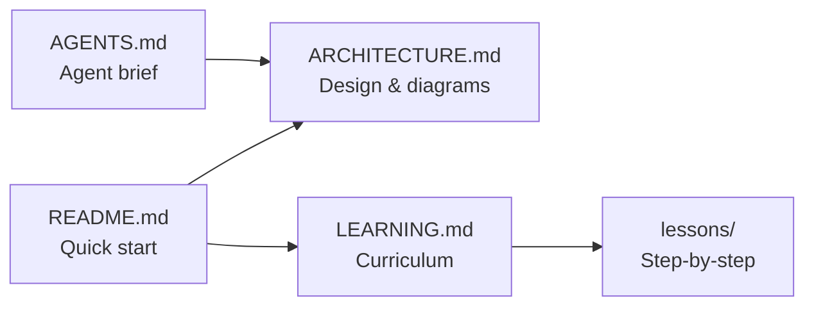

# Documentation Hub

> Playwright + TypeScript SDET framework — architecture, learning path, and visual references.

## Start here

| I want to…                                 | Go to                                                            |
| ------------------------------------------ | ---------------------------------------------------------------- |
| Understand how the framework fits together | [ARCHITECTURE.md](./ARCHITECTURE.md)                             |
| Learn Playwright + TypeScript hands-on     | [LEARNING.md](./LEARNING.md)                                     |
| See all diagrams in one place              | [ARCHITECTURE.md#diagram-index](./ARCHITECTURE.md#diagram-index) |
| Onboard a Cursor agent                     | [../AGENTS.md](../AGENTS.md)                                     |
| Run tests quickly                          | [../README.md#running-tests](../README.md#running-tests)         |

## Document map

## Lessons

| #   | Topic               | File                                                                     |
| --- | ------------------- | ------------------------------------------------------------------------ |
| 01  | Framework map       | [lessons/01-framework-map.md](./lessons/01-framework-map.md)             |
| 02  | Playwright projects | [lessons/02-playwright-projects.md](./lessons/02-playwright-projects.md) |
| 11  | Mocking strategies  | [lessons/11-mocking-strategies.md](./lessons/11-mocking-strategies.md)   |

Lessons 03–10 are indexed in [LEARNING.md](./LEARNING.md) — ask the agent: _"Teach me Lesson 03"_.
