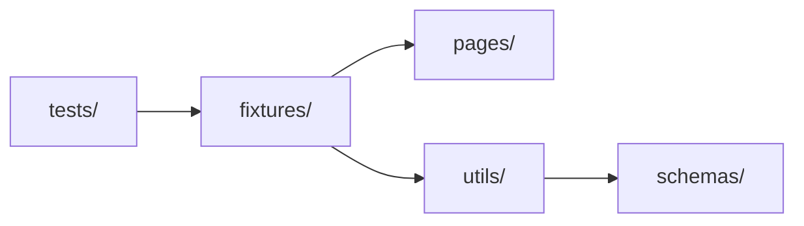

# Lesson 01: Framework Map

## 1. Simple explanation

A **framework** is the structure _around_ tests — config, fixtures, page objects, schemas, CI. Tests stay thin; the framework carries complexity.

## 2. Why it matters

Without it, every engineer copies login code, uses brittle locators, and runs everything on every PR. A framework enforces **one way** to build tests so the suite scales.

## 3. Visual map (this repo)



Full diagrams: [ARCHITECTURE.md](../ARCHITECTURE.md)

## 4. Run each layer

```bash
npm run test:unit    # 12 tests · ~2s · no browser
npm run test:api     #  5 tests · ~2s · HTTP only
npm run test:ui      #  7 tests · ~5s · browser + auth setup
npm run test:mock    #  6 tests · MSW + Docker + page.route
```

## 5. Good vs bad

**Bad** — everything in one spec:

```typescript
await page.goto('https://www.saucedemo.com');
await page.fill('#user-name', 'standard_user');
// 40 more lines...
```

**Good** — framework layers:

```typescript
test('should login...', { tag: '@smoke' }, async ({ loginPage, dashboardPage, config }) => {
  await loginPage.open();
  await loginPage.login(config.credentials.username, config.credentials.password);
  await expect(dashboardPage.pageTitle).toHaveText('Products');
});
```

## 6. Mini exercise

1. Open [ARCHITECTURE.md §2](../ARCHITECTURE.md#2-playwright-projects) — list all 8 Playwright projects
2. Run `npm run test:pr` and note the three stages (unit → api → smoke)
3. Find where `BASE_URL` is loaded (`utils/config-loader.ts`)

## 7. Checkpoint questions

1. What project runs `tests/api/` and does it need browser auth setup?
2. Why are Page Objects in `pages/` instead of `tests/`?
3. What command simulates CI on a PR?

---

**Next:** [Lesson 02 — Playwright Projects](02-playwright-projects.md)
