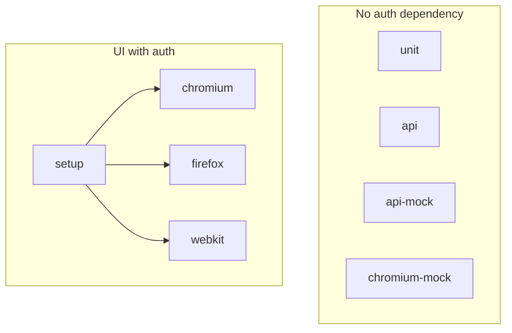

# Lesson 02: Playwright Projects

## 1. Simple explanation

A **Playwright project** is a named slice of config: which tests run, which browser, and what must run first (`dependencies`).

## 2. Why it matters

One `playwright.config.ts` can run unit tests without a browser, API tests without auth, and UI tests with a shared login — each with the right rules.

## 3. Project graph (current)



See full table: [ARCHITECTURE.md §2](../ARCHITECTURE.md#2-playwright-projects)

## 4. Simplified config

```typescript
// playwright.config.ts (conceptual)
projects: [
  { name: 'unit',      testMatch: /tests\/unit\// },
  { name: 'api',       testMatch: /tests\/api\//, testIgnore: /(msw|container)-/ },
  { name: 'api-mock',  testMatch: /(msw|container)-/ },
  { name: 'setup',     testMatch: /auth\.setup\.ts/ },
  { name: 'chromium',  dependencies: ['setup'] },
];
```

## 5. Good vs bad

| Bad | Good |
|-----|------|
| One project for everything | Layer-specific projects |
| API waits for UI auth setup | `api` has no `dependencies` |
| Full browser matrix on PR | `@smoke` on chromium only |

## 6. Mini exercise

```bash
time npm run test:api     # should be ~2s
time npm test             # full suite — much longer
```

Open `playwright.config.ts` and find `testIgnore` on the `api` project — why exclude `msw-*` and `container-*`?

## 7. Checkpoint questions

1. Which project runs `auth.setup.ts`?
2. Why does `chromium-mock` not depend on `setup`?
3. What is the difference between `api` and `api-mock` projects?

---

**Next:** [Lesson 11 — Mocking Strategies](11-mocking-strategies.md) or ask the agent: *"Teach me Lesson 03"*
