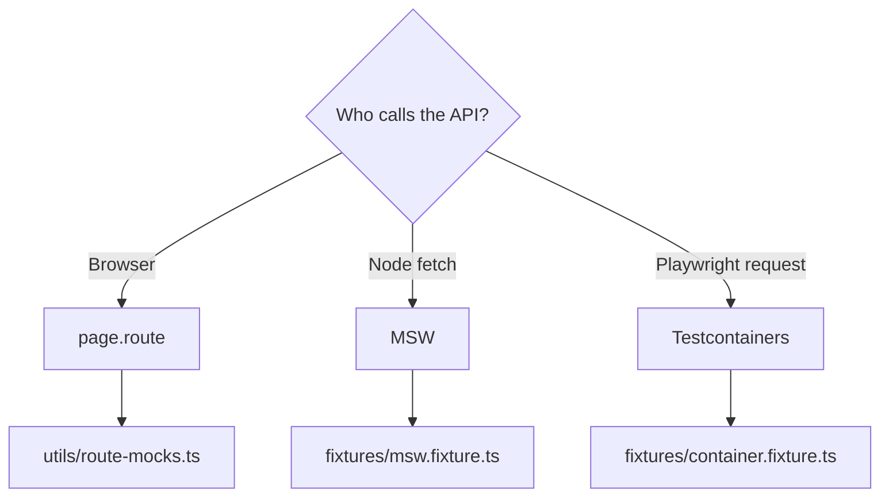

# Lesson 11: Mocking Strategies

## 1. Simple explanation

**Mocking** replaces real network responses with controlled data. This framework supports three approaches — each targets a different test layer.

## 2. Why it matters

- Test edge cases without depending on external APIs
- Run fast, deterministic tests in CI
- Isolate UI from backend flakiness

## 3. Decision diagram



Full reference: [ARCHITECTURE.md §6](../ARCHITECTURE.md#6-mocking-strategies)

## 4. Three patterns in this repo

### A. `page.route` — browser network

```typescript
import { mockJsonRoute } from '@utils/route-mocks';

await mockJsonRoute(page, '**/users/1', MOCK_USER);
// browser fetch now returns MOCK_USER
```

**File:** `tests/ui/network-mock.spec.ts` · **Project:** `chromium-mock`

### B. MSW — Node `fetch`

```typescript
import { mswTest as test } from '@fixtures/msw.fixture';

test('...', async ({ fetchApiClient }) => {
  const users = await fetchApiClient.getValidated(path, ApiUsersSchema);
});
```

**Important:** Use `fetchApiClient`, not `apiClient`. MSW does not intercept Playwright `request`.

**File:** `tests/api/msw-users.spec.ts` · **Project:** `api-mock`

### C. Testcontainers — real HTTP to Docker

```typescript
import { containerTest as test } from '@fixtures/container.fixture';

test('...', async ({ mockApiClient }) => {
  const users = await mockApiClient.getValidated(path, ApiUsersSchema);
});
```

**Requires:** Docker running. Stubs live in `docker/wiremock/mappings/`.

**File:** `tests/api/container-users.spec.ts` · **Project:** `api-mock`

## 5. Good vs bad

| Bad                                    | Good                                 |
| -------------------------------------- | ------------------------------------ |
| `waitForTimeout` waiting for API       | Mock response + `expect`             |
| One mock tool for everything           | Pick by layer (see diagram)          |
| MSW with `apiClient` (request fixture) | MSW with `fetchApiClient`            |
| Mock tests on every PR                 | Tag `@mock`, run nightly / on demand |

## 6. Mini exercise

```bash
npm run test:mock
```

1. Which 6 tests run? (2 MSW + 2 container + 2 page.route)
2. Run `SKIP_DOCKER_TESTS=true npm run test:mock` — what gets skipped?
3. Open `mocks/handlers.ts` — what URL patterns are stubbed?

## 7. Checkpoint questions

1. Why can't MSW intercept Playwright's `request` fixture?
2. When would you choose Testcontainers over MSW?
3. What fixture do you import for an authenticated UI test vs an MSW API test?

---

**Next:** Ask the agent _"Teach me Lesson 03 — Fixtures"_ for the full fixture composition deep dive.
