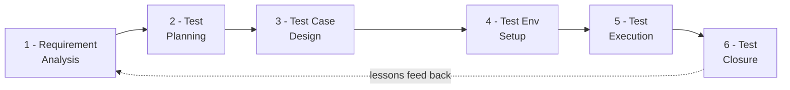
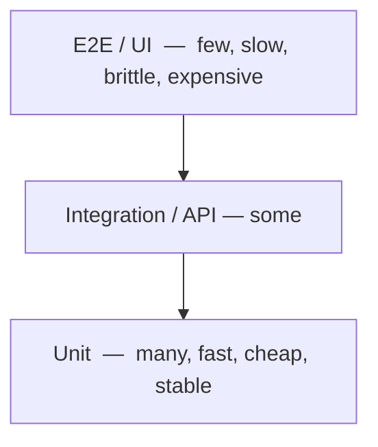
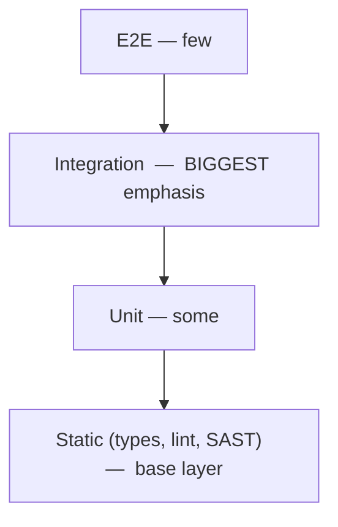
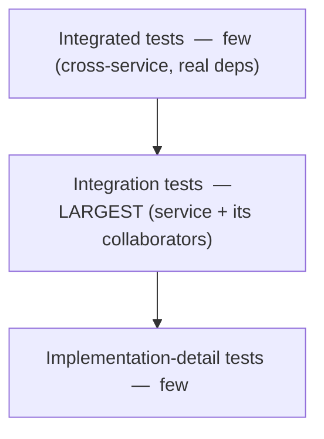
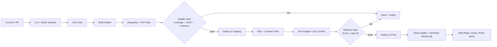
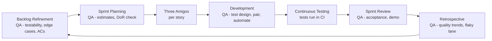
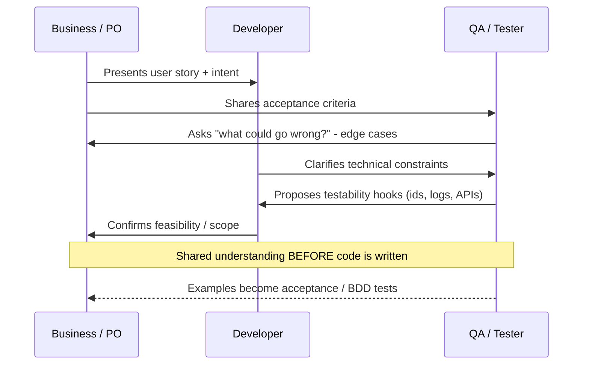
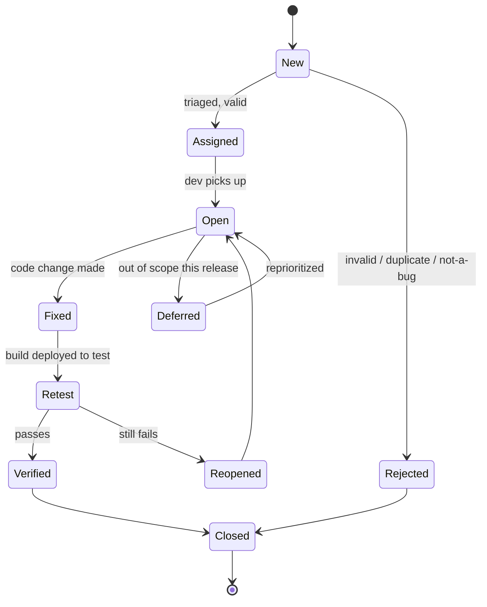
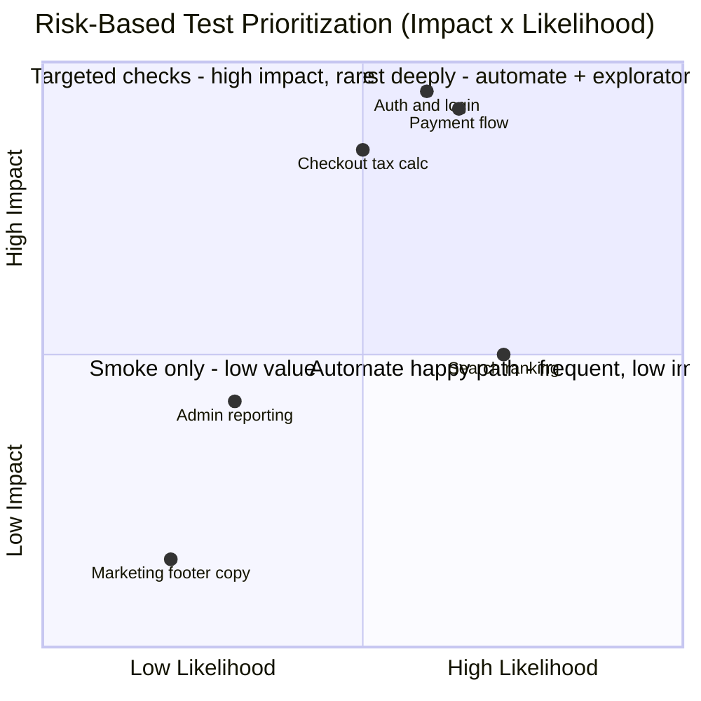

# Senior / Lead QA Automation — Interview Reference & Talk-Track Guide

> Built for a 14+ yr QA engineer targeting Senior / Lead / AI-QA-Architect roles (€82–95K+, Frankfurt).
> Optimized for **speaking**, not just reading. Every major topic has a *soundbite*, a *senior signal*, and *anti-patterns*.

---

## 0. How to USE this guide — and how to SOUND senior

The single biggest reason strong engineers get dinged in senior interviews is **staying abstract**. The fix is mechanical:

> **The 4-beat senior answer:** **Decision → Trade-off → Concrete example (tool + number) → Risk.**
> "I'd do X over Y *because* [trade-off]. At [company] I did exactly this with [tool] and it cut [metric] by [number]. The risk to watch is [Z], which I mitigate by [W]."

| Mid-level answer | Senior answer |
|---|---|
| "We use the test pyramid." | "I bias to a pyramid for our microservices, but for our React app I actually run a Trophy shape — most value sits in integration tests. The trade-off is slower CI, which I cap with sharding." |
| "We automate regression." | "I automate by *risk and frequency*, not by default. The payment path is fully automated and gated in CI; the rarely-touched admin export I leave as a manual checklist — automating it was negative ROI." |
| "I found a critical bug." | "I caught a race condition in the checkout that only fired under concurrent load — I reproduced it with a k6 spike test, filed it Sev-1, and added a regression test so it couldn't escape again." |

**Rules for the room:**
- **Name the tool, the number, the story.** Never leave an abstraction un-anchored.
- **Lead with the decision**, then justify. Don't narrate your way to a point.
- **Volunteer the trade-off and the risk** — that's the seniority tell. Anyone can list a practice; seniors know when *not* to use it.
- **If you don't know something, frame how you'd find out** — don't go silent. "I haven't used Gatling, but I'd evaluate it against k6 on scripting ergonomics and CI integration."
- **Talk in risk and business impact**, not test-case counts.

---

## 1. SDLC models & where QA fits

| Model | How it works | Where QA fits | When it's the right call |
|---|---|---|---|
| **Waterfall** | Sequential phases; testing is a late phase | QA at the end, validates against frozen spec | Fixed-scope, regulated, contract-heavy (some gov/medical) |
| **V-Model** | Each dev phase has a paired test phase (verification ↔ validation) | QA designs test levels *in parallel* with each dev stage (unit↔unit tests, design↔integration, reqs↔UAT) | Safety-critical, traceability-heavy (automotive, medical devices) |
| **Agile (Scrum/Kanban)** | Iterative, incremental, short feedback loops | QA *embedded* in the team, continuous, owns testability + quality coaching | Most product work; evolving requirements |
| **DevOps / Continuous Delivery** | Automated pipeline from commit → prod; CALMS culture | QA = quality engineering: gates in CI, shift-left + shift-right, observability | Fast-moving SaaS, high deploy frequency |

**Senior framing:** these aren't a maturity ladder — they're context choices. A Frankfurt fintech might run DevOps for the web app *and* a V-Model-flavored process for a BaFin-regulated reporting module in the same org.

> **🎯 Senior signal:** You can map QA responsibilities onto *any* model and explain the trade-off, rather than assuming "Agile = good, Waterfall = bad."
> **⚠️ Anti-pattern:** Calling Waterfall "wrong." It's wrong *for evolving requirements*; it's correct for fixed-scope regulated delivery.
> **🎤 Soundbite:** "QA's job doesn't change across SDLC models — *when* and *how often* we test does. In Waterfall I'd protect a hardening phase; in DevOps I move that same assurance left into gates and right into production monitoring."

---

## 2. STLC — six phases with entry/exit criteria



| Phase | Entry criteria | Key activities | Exit criteria | Deliverables |
|---|---|---|---|---|
| **1. Requirement Analysis** | Requirements / ACs available | Identify testable reqs, testability gaps, automation feasibility, risk | Requirements understood & sign-off on testability | RTM (traceability matrix), automation feasibility |
| **2. Test Planning** | Reqs analyzed | Scope, strategy, estimates, tooling, env, risk, roles | Plan reviewed & approved | Test plan, strategy, effort estimate |
| **3. Test Case Design** | Plan approved | Write cases/scripts, design data, apply techniques (EP/BVA/etc.) | Cases reviewed; data ready | Test cases, scripts, test data |
| **4. Env Setup** | Design done (can parallelize) | Provision env, test data, integrations, stubs | Smoke test passes on env | Ready environment, smoke results |
| **5. Test Execution** | Env ready + cases ready | Run tests, log defects, retest, regression | All planned tests run; defects triaged | Execution logs, defect reports, results |
| **6. Test Closure** | Execution complete + exit met | Report, metrics, retro, archive | Sign-off; lessons captured | Test summary report, metrics, lessons learned |

**Senior framing:** entry/exit criteria are *negotiation tools*, not bureaucracy. "We won't enter execution without a green smoke on the env" is how you stop the team from burning a sprint testing a broken deployment.

> **🎯 Senior signal:** You treat exit criteria as **risk-acceptance conversations** ("we're shipping with 2 open Sev-3s; here's the residual risk") rather than a checklist.
> **🎤 Soundbite:** "I don't gate on '100% of cases passed' — I gate on *risk*. My exit criterion is 'zero open criticals, all high-risk paths green, and explicit sign-off on any accepted residual risk.'"

---

## 3. Levels of testing — ownership & boundaries

| Level | What it verifies | Primary owner | Boundary / scope |
|---|---|---|---|
| **Unit** | Smallest piece (function/class) in isolation | **Developers** | No I/O; mocks/stubs; milliseconds |
| **Integration** | Modules/services talk correctly | Dev + QA (shared) | API contracts, DB, queues, service-to-service |
| **System** | Whole integrated app vs requirements | **QA** | End-to-end behavior, NFRs, in a prod-like env |
| **Acceptance (UAT)** | Meets *business* needs / fit for use | **Business / PO / end users** | Real scenarios, sign-off for release |

**Senior framing:** the most valuable thing you say here is about **ownership culture** — *developers owning unit and contract tests* is the marker of a healthy org. If QA owns all testing, that's a smell.

> **🎯 Senior signal:** You push test ownership *down* (devs own unit/component) and *out* (PO owns acceptance), positioning QA as the architect of the strategy, not the bottleneck running everything.
> **⚠️ Anti-pattern:** "QA writes all the tests." Creates a queue, kills shift-left, and lets devs offload quality.
> **🎤 Soundbite:** "I draw a hard line: developers own unit and contract tests, QA owns system and the automation strategy, and the PO owns acceptance. My job is to make sure the *right* test lives at the *cheapest* level that can catch the bug."

---

## 4. Types of testing

**Functional** — *does it do the right thing?*
Smoke, sanity, regression, integration, system, UAT, API/functional, exploratory.

**Non-functional** — *how well does it do it?* (the "-ilities")

| Category | Question it answers | Tools you can name |
|---|---|---|
| Performance (load/stress/soak/spike) | Fast & stable under load? | k6, Gatling, JMeter, Locust |
| Security | Resistant to abuse? | OWASP ZAP, Burp, Snyk, SAST/DAST/SCA |
| Accessibility | Usable by everyone? | axe-core, Lighthouse, screen readers |
| Usability | Easy/intuitive? | Heuristics, user testing |
| Reliability / Resilience | Recovers from failure? | Chaos tooling, fault injection |
| Compatibility | Across browsers/OS/devices? | BrowserStack, Sauce, Playwright projects |
| Scalability | Grows gracefully? | Load profiling, soak tests |
| Localization / i18n | Works per locale? | Pseudo-localization |

**Structural (white-box)** — based on code internals: statement/branch/path/condition coverage.

**Change-related** — **Re-testing** (confirm a specific fix works) vs **Regression** (confirm the fix broke nothing else). *Don't conflate these in an interview — it's a classic differentiator.*

> **🎯 Senior signal:** You separate **re-testing** (targeted, on the fixed defect) from **regression** (broad, unchanged areas) crisply, and you scope regression by **change-impact analysis**, not "run everything."
> **🎤 Soundbite:** "Regression isn't 're-run the whole suite' — that's expensive and slow. I scope it by impact analysis: what code changed, what depends on it, plus a stable high-risk core that always runs."

---

## 5. Test design techniques — with worked examples

### Equivalence Partitioning (EP)
Divide inputs into classes that should behave identically; test one value per class.
*Example — age field accepts 18–65:* classes = `<18` (invalid), `18–65` (valid), `>65` (invalid). Test e.g. `15, 30, 70`. 3 tests instead of dozens.

### Boundary Value Analysis (BVA)
Bugs cluster at edges. Test the boundary and its neighbours.
*Same field:* 2-value BVA → `17,18` and `65,66`; 3-value BVA → `17,18,19` and `64,65,66`. Plus the data-type min/max.

### Decision Table
For combinatorial business rules. Conditions → actions.
*Example — login:*

| Rule | Valid user? | Valid pwd? | Account locked? | → Action |
|---|---|---|---|---|
| R1 | Y | Y | N | Grant access |
| R2 | Y | Y | Y | Show "account locked" |
| R3 | Y | N | N | "Invalid credentials" + increment fail count |
| R4 | N | – | – | "Invalid credentials" |

### State Transition
For systems where behavior depends on history/state.
*Example — lockout after 3 fails:* states `LoggedOut → (fail×3) → Locked → (timeout/reset) → LoggedOut`. Tests cover valid transitions, invalid ones, and the boundary (3rd fail triggers lock).

### Pairwise / Combinatorial
Most defects come from single- or two-factor interactions, so test all *pairs* instead of the full cross-product.
*Example — 3 browsers × 3 OS × 4 payment methods = 36 combos →* ~12–16 with pairwise. Tools: **PICT, AllPairs, pict-cli**.

### Error Guessing (experience-based)
Empty/null inputs, leading/trailing spaces, special chars, emojis, leading zeros, huge payloads, simultaneous actions, back-button, double-submit, expired tokens, timezone/DST edges.

> **🎯 Senior signal:** You pick the technique to **shrink an exploding input space with justification** ("pairwise here because we had 200+ config combos and a 3-day cycle"), and you pair formal techniques with **structured exploratory testing** under charters.
> **⚠️ Anti-pattern:** Listing techniques as trivia. Interviewers want to hear you *apply* one to a real combinatorial problem and quantify the reduction.
> **🎤 Soundbite:** "Test design is about coverage *per test spent*. For a config matrix that blew up to hundreds of combinations I used pairwise to get from ~200 down to ~20 cases while still covering every two-way interaction — that's where most defects hide."

---

## 6. Test Pyramid + Trophy + Honeycomb — when each applies

### Classic Pyramid (Mike Cohn)

Bias: **most tests at the bottom.** Best for **service-heavy / microservice backends** with rich business logic.

### Testing Trophy (Kent C. Dodds)

Bias: **integration tests carry the most weight**, with a static-analysis base. Best for **frontend / component-heavy apps** (React/TS) where "units" are trivial but *integration* of components + state is where bugs live.

### Honeycomb (Spotify)

Bias: **fat middle of integration tests**, thin on both implementation-detail and full cross-service tests. Best for **microservice architectures** where isolated units mislead and full E2E is too flaky.

| | Classic Pyramid | Trophy | Honeycomb |
|---|---|---|---|
| **Bulk of tests** | Unit | Integration | Integration |
| **Best for** | Logic-heavy backends | Frontend/UI apps | Microservices |
| **Core belief** | Cheap fast units catch most | Test how users use it | Units lie; integration is truth |
| **Risk if misapplied** | Over-mocked units, false confidence | Slow CI | Hard-to-isolate failures |

> **🎯 Senior signal:** You don't worship one shape — you pick by **architecture and where defects actually escape**, and you can cite the trade-off (Trophy = higher confidence but slower CI → mitigate with sharding/parallelism).
> **⚠️ Anti-pattern:** "Always follow the pyramid." For a thin-logic React app, a strict pyramid produces lots of low-value unit tests and misses integration bugs.
> **🎤 Soundbite:** "Shape follows architecture. Backend microservices → I lean honeycomb/integration-heavy because mocked units give false confidence. A React app → Trophy, because the value is in component integration. The pyramid is a default, not a law."

---

## 7. Test automation strategy — what to automate vs. leave manual (ROI)

**Automate when:** high business risk, run frequently, stable requirements, deterministic, data-driven repetition, regression-critical, hard/slow to do manually.
**Keep manual when:** one-off, exploratory, UX/look-and-feel judgement, rapidly changing UI, very low frequency, or where the *cost to automate + maintain* exceeds the value.

**ROI framing (the senior move):**

```
ROI ≈ (Manual cost per run × runs per period × periods)
      − (Build cost + Maintenance cost per period × periods)
```
If a test runs every commit for 2 years, automation almost always wins. If it runs twice a year, it usually loses. **Maintenance is the silent killer** — a flaky suite has *negative* ROI because it erodes trust and people start ignoring red builds.

| Decision axis | Automate | Manual |
|---|---|---|
| Frequency | Every commit / nightly | Once / rarely |
| Risk | Revenue/safety/compliance path | Cosmetic, low-traffic |
| Stability | Stable contract | UI/flow in flux |
| Determinism | Predictable | Subjective/visual |
| Test type | Regression, API, data perms | Exploratory, usability |

> **🎯 Senior signal:** You frame automation as a **portfolio investment with maintenance cost and a trust budget**, not a coverage trophy. You'd *delete* low-value flaky tests rather than retry-spam them.
> **⚠️ Anti-pattern:** "Automate everything" / "Aim for 100% automation." The goal is *risk coverage at sustainable cost*, not a percentage.
> **🎤 Soundbite:** "I automate by risk × frequency, and I treat the suite as a portfolio with a maintenance budget. A flaky test has negative ROI — it costs trust — so I either fix the root cause, quarantine it, or delete it. 'Automate everything' is how teams end up with a slow suite nobody trusts."

---

## 8. Framework design principles (POM, Screenplay, data-driven, BDD)

| Pattern | Idea | Strength | Watch-out |
|---|---|---|---|
| **Page Object Model (POM)** | Encapsulate page locators/actions in classes | Simple, readable, ubiquitous | Page objects bloat; fragile for complex flows |
| **Screenplay** | Actors perform Tasks, ask Questions (Serenity/BDD) | Scales for complex user journeys, composable | Steeper learning curve, over-engineered for small suites |
| **Data-driven** | Externalize data; one script, many datasets | Coverage scale, easy to extend | Needs solid test-data management |
| **Keyword-driven** | Tests as keyword tables | Non-coders can author | Legacy feel, indirection overhead |
| **BDD (Gherkin)** | Given/When/Then, business-readable | Shared language with PO/business; living docs | Becomes overhead if no business reader; "BDD theatre" with devs writing steps for themselves |

**Cross-cutting principles a senior actually cares about** (more than the pattern name):
- **Determinism / no flakiness** — explicit waits over sleeps, control test data, isolate state, idempotent setup/teardown.
- **Independence & parallelizability** — tests must run in any order, in parallel; no shared mutable state.
- **Test data management** — fixtures, factories, API-based setup (not UI), seeded/ephemeral data, cleanup.
- **Layered architecture** — separate test logic / page or service abstractions / utilities / config / reporting.
- **Single responsibility per test**, clear naming, good failure diagnostics (screenshots, traces, video, logs).
- **Stable selectors** — `data-testid` over brittle CSS/XPath.
- **Flaky-test policy** — quarantine lane + root-cause within N days, not blanket retries.

> **🎯 Senior signal:** You talk about **flakiness, determinism, parallelization, and test-data strategy** — the things that actually decide whether automation survives at scale — not just "we use POM."
> **🎤 Soundbite:** "Pattern is secondary; determinism is everything. I set state via API not UI, give every test isolated data so it can run in parallel in any order, and I enforce a flaky-test policy — quarantine and root-cause, never blind retries. A suite people trust beats a big suite people ignore."

---

## 9. CI/CD integration, quality gates, shift-left & shift-right



**Quality gates** (fail the build on objective thresholds):
- Unit coverage threshold on changed code (e.g., ≥80% on diff, not global vanity number)
- No new criticals/highs from SAST + SCA (dependency vulns)
- Contract tests pass (consumer + provider)
- Performance budget not regressed (p95 latency, bundle size)
- Zero critical accessibility violations
- No new secrets detected

**Shift-left** = move quality *earlier*: static analysis, unit/contract tests, testability in design reviews, Three Amigos, linting, pre-commit hooks. Cheaper to fix early.

**Shift-right** = test/learn *in production*: canary & blue-green releases, feature flags, synthetic monitoring, RUM, observability-driven testing, A/B, **chaos engineering**. You can't pre-prod everything; production is a test environment you instrument.

```yaml
# Illustrative GitHub Actions stage with an eval/quality gate
jobs:
  test:
    steps:
      - run: npm run lint
      - run: npm run test:unit -- --coverage
      - run: npm run test:contract        # Pact verification
      - run: npx playwright test --shard=${{ matrix.shard }}/4
      - name: Quality gate
        run: |
          ./scripts/check_coverage.sh 80      # fail < 80% on diff
          ./scripts/check_sast.sh             # fail on new critical/high
          ./scripts/check_perf_budget.sh      # fail on p95 regression
```

> **🎯 Senior signal:** You speak of quality as a **pipeline of objective gates plus production feedback**, and you balance both directions — shift-left to prevent, shift-right because you *can't* catch everything pre-prod.
> **⚠️ Anti-pattern:** Treating shift-left as "QA tests sooner" only. It's a *whole-team* prevention practice (devs, design, product), not QA doing the same work earlier.
> **🎤 Soundbite:** "I gate on objective signals — diff coverage, no new critical CVEs, contracts green, perf budget held — so 'red means stop' is real. Then I shift right: canary plus synthetic monitoring and good observability, because prod is the one environment you can't fully replicate, so you instrument it and learn fast."

---

## 10. QA in Agile — ceremonies, Three Amigos, DoR/DoD, cadence



**Three Amigos** — Business/PO + Developer + QA align on a story *before* code, surfacing edge cases and turning examples into acceptance tests.



**Definition of Ready (DoR)** — a story is ready to *pull in*: clear ACs, dependencies known, testable, estimable, sized to fit a sprint.
**Definition of Done (DoD)** — a story is *done*: code merged, unit + automated acceptance tests pass, code reviewed, no open criticals, docs updated, deployed to staging, AC verified.

> **🎯 Senior signal:** You position QA as a **quality coach who prevents defects via testability + Three Amigos**, owns the DoR/DoD as team agreements, and tracks *quality trends* in retros — not someone who waits for a "testing column" at sprint-end.
> **⚠️ Anti-pattern:** "Mini-waterfall in a sprint" — devs build all week, throw it over the wall to QA on day 9. The senior fix: continuous testing, pairing, and slicing stories thin.
> **🎤 Soundbite:** "I refuse the day-9 hand-off. QA's biggest leverage is *before* code — testability in refinement and Three Amigos to surface edge cases early. The cheapest defect is the one we design out in a conversation, and the examples we agree on become the acceptance tests."

---

## 11. Defect lifecycle, severity vs priority, good bug reports



**Severity vs Priority** (independent axes — the classic interview trap):
- **Severity** = technical *impact* of the defect (set by QA/eng).
- **Priority** = *urgency* to fix, business-driven (set by PO/business).

| | High Priority | Low Priority |
|---|---|---|
| **High Severity** | Checkout crashes for all users → fix now | App crashes only in a config used once a year → fix eventually |
| **Low Severity** | Company name misspelled on homepage → cosmetic but ship-blocking for brand | Typo in a help-page footer → backlog |

**Anatomy of a great bug report:**
- **Title:** specific + observable ("Checkout 500s when promo code applied to empty cart" — not "checkout broken")
- Environment & build/version, preconditions, **numbered steps**, **expected vs actual**, evidence (**Playwright trace / video / screenshot / logs / network**), **severity + priority + business impact**, regression info (worked in build X?), frequency (always/intermittent).

> **🎯 Senior signal:** You keep severity and priority **strictly separate** and you make defect reports *actionable and reproducible* — and you think about **defect prevention and leakage trends**, not just logging bugs.
> **⚠️ Anti-pattern:** "Critical severity therefore fix immediately." Not necessarily — a high-severity crash in a never-used path can be low priority. Conflating the two signals you've never owned triage.
> **🎤 Soundbite:** "Severity is impact, priority is urgency, and they're independent — a brand-damaging homepage typo is low severity but ship-blocking priority. Beyond triage I watch *leakage*: which defects escaped to prod and why, then I push a prevention upstream so the same class can't recur."

---

## 12. QA metrics that matter vs. vanity metrics

**DORA (delivery health — QA strongly influences all four):**

| Metric | What it measures | Elite-ish band |
|---|---|---|
| **Deployment Frequency** | How often you ship to prod | On-demand / multiple per day |
| **Lead Time for Changes** | Commit → running in prod | < 1 day |
| **Change Failure Rate** | % of deploys causing a prod incident | 0–15% |
| **MTTR / Time to Restore** | How fast you recover from failure | < 1 hour |

**Quality-specific metrics that matter:**
- **Defect leakage / escape rate** = defects found in prod ÷ total defects. *The single best QA-effectiveness signal.* Lower = better prevention.
- **Defect density** = defects per KLOC / per feature / per story point.
- **MTTD** (mean time to *detect*) — how fast monitoring/tests catch a prod issue.
- **Test effectiveness** = defects caught by tests ÷ total defects.
- **Flaky-test rate** & **mean time to fix flaky**.
- **Automation pass rate *in context*** (with flake rate alongside it).
- **Requirements/risk coverage** (not just code coverage).

**Vanity metrics (call these out — it's a seniority tell):**
- Raw **number of test cases** ("we have 5,000 tests" — so what? how many are valuable?)
- **% automated** as a *goal in itself*
- **Code coverage as a sole target** (you can hit 90% and test nothing meaningful — Goodhart's law: it becomes a target, stops being a measure)
- **Pass rate without flake context**
- **Bug count** divorced from severity/impact

> **🎯 Senior signal:** You tie QA to **DORA + defect leakage** (business/delivery outcomes) and you actively *warn against* coverage and test-count as targets, invoking Goodhart's law.
> **⚠️ Anti-pattern:** Reporting "98% pass rate, 90% coverage, 5,000 tests" with no link to escaped defects or business risk. That's a dashboard, not insight.
> **🎤 Soundbite:** "My north-star metric is defect leakage — what escaped to production and why — because that measures *prevention*, which is the point of QA. I deliberately avoid coverage or test-count as targets; the moment a number becomes a goal it gets gamed. I report quality as DORA plus escape rate, framed in customer impact."

---

## 13. Risk-based testing — how a Senior frames *everything* in risk terms

Risk = **Likelihood × Impact.** You can't test everything, so you allocate effort by risk and make residual risk *explicit*.



*If the quadrant chart doesn't render, the same matrix as a table:*

| | **High Impact** | **Low Impact** |
|---|---|---|
| **High Likelihood** | **Highest priority** — deep automated + exploratory (payments, auth) | Automate happy path, light beyond (high-traffic but low-stakes) |
| **Low Likelihood** | Targeted automated checks (rare but catastrophic — data loss, money) | Smoke / defer (footer copy, rarely-used admin) |

**How to *operate* it:**
1. Identify risk areas with the team (product, eng, support data, prod incidents).
2. Score likelihood × impact.
3. Allocate test depth + technique by quadrant.
4. State residual risk at release ("we did not load-test the export path; risk = slow exports for >10k-row tenants; mitigated by a feature flag").

> **🎯 Senior signal:** Risk is your **default language for prioritization, sign-off, and saying "no"**. You make residual risk explicit so the *business* owns the accept/reject call — you inform, they decide.
> **🎤 Soundbite:** "I don't aim for exhaustive coverage — I aim for *risk* coverage. I score features by likelihood and impact, pour depth into the top-right (money, auth, data integrity), and at release I state the residual risk explicitly so the business makes an informed accept-or-block decision. That reframes QA from gatekeeper to risk advisor."

---

## 14. Modern topics (the breadth that signals senior+)

**API & Contract testing**
- API: schema/status/contract/negative/auth tests. Tools: **Playwright APIRequest, REST Assured, pytest+httpx, Postman/Newman, Karate**.
- **Contract testing (consumer-driven, e.g., Pact):** consumer and provider agree a contract; provider verification runs in *their* pipeline. **Replaces brittle, slow cross-service E2E** in microservices — you verify integration points without standing up the whole world.

**Service virtualization** — stub/mock unstable or costly third parties (payment gateways, partner APIs) for deterministic tests. Tools: **WireMock, Mountebank, Hoverfly, Mockoon**.

**Performance** — load / stress / soak / spike / scalability. Metrics: **p95/p99 latency, throughput (RPS), error rate, saturation**. Tie to **SLOs**; bake a **perf budget** into CI. Tools: **k6, Gatling, JMeter, Locust**.

**Security (OWASP)**
- **OWASP Top 10 (2021):** Broken Access Control, Cryptographic Failures, Injection, Insecure Design, Security Misconfiguration, Vulnerable/Outdated Components, Identification & Auth Failures, Software & Data Integrity Failures, Security Logging & Monitoring Failures, SSRF. *(Verify if a newer edition has shipped.)*
- Practices QA owns/partners on: **SAST** (code), **DAST** (running app, OWASP ZAP), **SCA** (dependencies, Snyk/Dependabot), secrets scanning. Also **OWASP API Security Top 10**.

**Accessibility (a11y)**
- **WCAG 2.2**, levels A/AA/AAA, **POUR** (Perceivable, Operable, Understandable, Robust). Automate with **axe-core / Lighthouse / Pa11y**, then manual keyboard + screen-reader passes (automation catches ~30–40% only).
- **EU angle (Frankfurt differentiator):** the **European Accessibility Act (EAA)** obligations apply from **28 June 2025** for many digital products/services — a real compliance driver for EU products. *(Confirm current scope for the specific role.)*

**Observability** — logs + metrics + traces (**OpenTelemetry**), **SLI/SLO/error budgets**. QA uses it to test *in* prod, validate releases (canary metrics), and accelerate triage ("the trace shows the 500 originates in the tax service").

**Chaos engineering** — hypothesis-driven failure injection ("if the cache dies, we degrade gracefully"), controlled blast radius, **GameDays**. Tools: **Chaos Monkey, Litmus, Gremlin, AWS FIS**. It's *resilience* testing — verifying the system's behavior under failure, not just under load.

> **🎯 Senior signal:** You know *why* each exists and the trade-off — e.g., "contract tests over E2E for microservices because E2E is flaky and slow at scale" — and you connect them (observability enabling shift-right; SLOs feeding release gates).
> **🎤 Soundbite:** "In a microservices world I lean on consumer-driven contract tests with Pact instead of sprawling E2E — I verify the integration points each side depends on, in each pipeline, without the flakiness of standing up the whole system. E2E I keep to a thin, high-value smoke layer."

---

## 15. AI / LLM testing — your differentiator (go deep here)

### Why LLM testing is fundamentally different
Traditional testing assumes a **deterministic, single correct output**. LLMs are **non-deterministic**, **open-ended** (many valid answers), and fail in **semantic/probabilistic** ways (plausible-but-wrong) rather than throwing exceptions. So "assert equals" breaks down — you evaluate **quality dimensions against thresholds**, not exact matches. The senior reframe: **you build an *evaluation suite*, not a test suite, and you run it as a regression gate.**

### The evaluation paradigms

| Paradigm | What it is | Use when | Trade-off |
|---|---|---|---|
| **Reference-based** | Compare output to a golden/expected answer (exact, fuzzy, semantic similarity, BLEU/ROUGE) | You have ground truth | Curating goldens is costly; penalizes valid paraphrases |
| **Reference-free (LLM-as-judge)** | A strong model scores output on a rubric (G-Eval, faithfulness, relevance) | Open-ended outputs, no single answer | Judge bias, cost, needs calibration |
| **Statistical / NLP metrics** | BLEU, ROUGE, METEOR, semantic similarity (embeddings) | Summarization/translation, cheap & fast | Weak correlation with human judgment of *meaning* |
| **Human evaluation** | SMEs rate outputs | Gold standard, calibrating auto-evals, high-stakes | Slow, expensive, not CI-scalable |

**Senior practice:** layer them — cheap statistical + automated reference-free in CI on every change, periodic human eval to **calibrate** the auto-judges, reference-based on a curated golden set for regression.

### The quality dimensions you test for
- **Correctness / factuality** — is it right?
- **Hallucination** — fabricating facts not grounded in context/source.
- **Faithfulness / groundedness** — does the answer stick to the retrieved context (RAG)?
- **Answer relevancy** — does it actually address the question?
- **Context precision / recall** (RAG retrieval quality) — did we retrieve the right chunks, and rank them well?
- **Coherence / fluency**, **completeness**, **tone/format adherence**.
- **Toxicity, bias/fairness, PII leakage**.
- **Safety / guardrails** — refusals, jailbreak resistance, **prompt injection** (security).
- **Latency & cost per call** (non-functional — easy to forget, very senior to include).

### Tooling (name these with confidence — they're your edge)

| Tool | Sweet spot |
|---|---|
| **RAGAS** | RAG-specific metrics: **faithfulness, answer relevancy, context precision, context recall**. Best for evaluating retrieval + generation pipelines. |
| **DeepEval** | Pytest-native LLM eval: **G-Eval (custom rubric), hallucination, answer relevancy, faithfulness, contextual precision/recall, toxicity, bias, summarization**. Plugs straight into CI as assertions. |
| **Promptfoo** | **Prompt regression + side-by-side comparison** across prompts/models/providers; declarative assertions; **red-teaming / jailbreak** scans. Great for "did this prompt edit make things worse?" |

### Golden datasets — curation, versioning, maintenance
- **Curate** representative + adversarial + edge cases from real traffic, support tickets, known failure modes.
- **Structure:** input, retrieved context (for RAG), **expected/reference output or rubric**, metadata (category, difficulty).
- **Version it** (git/DVC) and treat changes as code-reviewed — your eval is only as trustworthy as your goldens.
- **Maintain:** expand when new failure modes appear in prod; **synthetic generation** (LLM-generated cases, human-reviewed) to scale; watch for **goldens going stale** as the product evolves.

### Regression on prompt / model changes — the CI gate (your hero mechanic)
The killer use case: **any prompt edit, model upgrade, or provider switch must clear measured thresholds before merge.** This converts "the AI feels worse today" into a *catchable regression*.

```yaml
# Eval gate in CI — illustrative
- name: LLM evaluation gate
  run: |
    deepeval test run eval_suite.py        # hallucination, relevancy, G-Eval
    ragas evaluate --dataset golden.jsonl  # faithfulness, context-precision
    promptfoo eval -c promptfoo.yaml        # prompt regression vs baseline
  # Fail the build if:
  #   faithfulness < 0.90  OR  answer_relevancy < 0.85
  #   OR hallucination_rate > 0.03  OR toxicity detected
  #   OR any metric regresses > 5% vs the committed baseline
```

**Handling non-determinism in the gate (senior nuance):**
- Set `temperature=0` for eval runs where possible; **pin model + provider version** (a silent vendor model update *is* a regression source).
- Use **threshold bands + multiple samples**, not exact match; track **statistical significance** — small golden sets give noisy deltas, so don't gate on a 1-sample 2% wobble.
- Maintain a **baseline** and alert on *drift*, not just absolute pass/fail.
- Manage **flaky evals** like flaky tests: investigate, don't blindly loosen thresholds.

### LLM-as-judge — the trap to name
Powerful but biased: **position bias** (favors first/last option), **verbosity bias** (longer = "better"), **self-preference** (a model rates its own family higher). Mitigate: randomize order, calibrate against human labels, prefer **pairwise** over pointwise where you can, and periodically audit the judge.

### Agentic / tool-using systems (the frontier — strong AI-QA-Architect signal)
Beyond single responses, you test **trajectories**: tool-selection correctness, argument correctness, multi-step task completion, recovery from tool errors, **excessive agency** / unsafe actions, and end-state validation. You instrument with **tracing** (every step observable) and evaluate the *path*, not just the final answer.

### OWASP Top 10 for LLM Applications (ties security to your AI edge)
Prompt Injection, Insecure Output Handling, Training-Data Poisoning, Model DoS, Supply-Chain vulns, Sensitive-Information Disclosure, Insecure Plugin/Tool Design, **Excessive Agency**, Overreliance, Model Theft. *(Confirm latest edition.)* Mention this and you've fused security + AI QA — rare and senior.

### 🦸 Your AI-QA hero-story arc (deliver this when asked "tell me about your most impactful work")
1. **Context:** "I led QA for an LLM-based enterprise copilot (a RAG product). Quality was subjective — 'it feels worse' — and there was no regression safety net for prompt or model changes."
2. **Action:** "I built an evaluation pipeline: a versioned golden dataset, multi-provider scoring (Anthropic + OpenAI), RAGAS faithfulness + context-precision and DeepEval hallucination/toxicity/relevancy, wired into CI as a quality gate with threshold + baseline-drift checks. I pinned model versions so silent vendor updates couldn't slip through."
3. **Result:** "Prompt and model changes now had to clear measurable bars before merge — we turned 'vibes' into catchable regressions, caught faithfulness drops before release, and gave product an objective quality signal."
4. **Judgment:** "The hard part wasn't the tools — it was judging *thresholds* and managing eval flakiness on small datasets, and calibrating the LLM-judge against human labels so the gate was trustworthy."

> **🎯 Senior signal:** You treat evals as **versioned, CI-gated regression suites with calibrated judges and statistical rigor**, you include **cost/latency and security (prompt injection, excessive agency)**, and you can reason about agentic trajectory evaluation — not just "we checked the outputs looked good."
> **⚠️ Anti-pattern:** "We manually spot-checked a few outputs" / "we used GPT to grade it" with no calibration, versioning, thresholds, or determinism control. That's a vibe check, and you should be able to explain *why* it doesn't scale.
> **🎤 Soundbite:** "I treat LLM evaluation as a regression suite, not a vibe check. For our RAG copilot I built a versioned golden dataset and ran RAGAS faithfulness plus DeepEval hallucination and toxicity as a CI gate, with pinned model versions and baseline-drift alerts. That turned 'the AI feels off today' into a regression we catch automatically — and the real craft is calibrating thresholds and the LLM-judge against human labels so the gate is trustworthy."

---

## 16. How a Senior / Lead QA actually operates (the behavioral differentiators)

This is what separates a **Lead/Architect hire** from a strong individual tester. Interviewers probe these hard.

| Dimension | Mid-level | Senior / Lead |
|---|---|---|
| **Strategy** | Executes a test plan | *Owns* the quality strategy across teams; decides the test architecture |
| **Influence** | Reports bugs | Influences design for testability & quality *without authority*; gets buy-in |
| **Mentoring** | Learns from others | Coaches devs to own tests, levels up the team, sets standards |
| **Tooling** | Uses given tools | Makes **build-vs-buy** decisions, runs PoCs, justifies cost/ROI to leadership |
| **Risk** | Tests what's assigned | Frames work as risk, communicates residual risk to stakeholders, says "no" with data |
| **Production** | Thinks pre-release | Thinks in **prod** — observability, SLOs, incident learning, shift-right |
| **Scope** | Their feature/team | Cross-functional; quality culture; process across the org |
| **Metrics** | Runs tests | Defines what "quality" *means* in measurable terms leadership trusts |

**Things to weave into behavioral answers:**
- **Quality is everyone's job** — your role is to enable it, not to be the sole gate. (Say this; it's the modern senior creed.)
- **Influence without authority** — a story where you changed a dev/PO decision with data, not mandate.
- **A tooling decision you owned** — chose X over Y after a PoC, and the trade-off/cost reasoning.
- **A time you advocated for quality against schedule pressure** — and how you framed it as risk to let the business decide.
- **Mentoring** — someone you levelled up, or a standard/guild you established.
- **A production incident you learned from** — and the prevention you drove upstream.

> **🎯 Senior signal:** You speak as a **quality leader and risk advisor who multiplies the team**, comfortable saying "here's the risk, the call is yours," not a gatekeeper who personally tests everything.
> **🎤 Soundbite:** "My job as a senior isn't to test everything — it's to make quality *the team's* job and to be the person who can put a number on risk. I influence through testability and data, I own the tooling and strategy decisions, and I think in production: SLOs, observability, and learning from incidents so the same class of defect can't recur."

---

## 17. Fifteen senior-level interview questions + framing guidance

> For each: **what they're really probing**, then the **answer skeleton** (structure, not a script). Always close on a trade-off or risk.

**1. "How do you decide what to automate and what to test manually?"**
*Probing:* ROI judgment, not dogma.
*Frame:* Risk × frequency × stability matrix → automate high-risk/high-frequency/stable, manual for exploratory/volatile/one-off → mention maintenance cost & flaky-test trust budget → concrete example with a number. **Trap to avoid:** "automate everything."

**2. "Walk me through your test strategy for a new microservice."**
*Probing:* Can you architect, not just execute.
*Frame:* Risk assessment first → test levels (unit by devs, contract via Pact, integration, thin E2E smoke) → honeycomb shape & why → CI gates → observability/SLOs in prod → residual risk. Name tools per layer.

**3. "Pyramid vs Trophy — which do you use?"**
*Probing:* Do you think in context or follow rules.
*Frame:* "Depends on architecture" → pyramid for logic-heavy backends, Trophy for frontend, honeycomb for microservices → state the trade-off (Trophy = more confidence, slower CI → shard) → what *you've* used and why.

**4. "Your CI pipeline is green but a critical bug reached production. What do you do?"**
*Probing:* Systems thinking, blamelessness, prevention.
*Frame:* Stabilize first (rollback/flag, MTTR) → blameless RCA → *why did it escape?* (gap in coverage? wrong test level? env diff?) → add regression at the cheapest level + close the systemic gap → track as defect-leakage signal. **Don't** blame a person.

**5. "How do you measure QA effectiveness / quality?"**
*Probing:* Outcome metrics vs vanity.
*Frame:* Defect leakage as north star → DORA → MTTD/MTTR, test effectiveness → explicitly reject coverage/test-count as *targets* (Goodhart) → tie to customer impact.

**6. "Tell me about a time you disagreed with a developer or PM about quality."**
*Probing:* Influence without authority.
*Frame:* STAR → framed it as *risk with data*, not opinion → proposed an option, let the business own the call → outcome + relationship intact. Seniority = "I inform, they decide."

**7. "How do you handle flaky tests?"**
*Probing:* Do you protect trust in the suite.
*Frame:* Root-cause categories (timing, test data, env, ordering) → quarantine lane with an SLA, never blanket retries → determinism practices (API setup, stable selectors, isolated data) → delete negative-ROI tests. **Trap:** "add a retry."

**8. "How would you test an LLM-powered feature?"** *(your moment — go deep)*
*Probing:* Genuine AI-QA depth.
*Frame:* Why deterministic testing fails → eval suite w/ golden dataset (versioned) → dimensions (faithfulness, hallucination, relevancy, toxicity, bias, PII, prompt injection, cost/latency) → RAGAS/DeepEval/Promptfoo in CI as a gate → threshold + baseline-drift, pinned model versions → LLM-as-judge bias & human calibration → agentic trajectory eval if relevant. Drop your hero story.

**9. "What's the difference between severity and priority? Give an example where they diverge."**
*Probing:* Fundamentals — and a common trap.
*Frame:* Severity = impact (eng), priority = urgency (business), independent → homepage typo = low sev / high pri; rare-config crash = high sev / low pri. Crisp, no rambling.

**10. "How do you bring quality earlier in the lifecycle (shift-left)?"**
*Probing:* Whole-team prevention vs "QA sooner."
*Frame:* Three Amigos, testability in design reviews, contract tests, static analysis/pre-commit, DoR/DoD as team agreements → "cheapest defect is the one designed out in a conversation" → and pair it with shift-right (you can't catch everything pre-prod).

**11. "Describe your ideal test automation framework architecture."**
*Probing:* Design maturity.
*Frame:* Layered (tests / page or service abstractions / utils / config / reporting) → determinism + parallelizability + test-data strategy → stable selectors, rich failure diagnostics (traces/video) → CI integration & sharding → pattern (POM/Screenplay) as a *means*. Emphasize maintainability over cleverness.

**12. "We're releasing tomorrow and not all testing is done. What's your call?"**
*Probing:* Risk-based decision-making under pressure.
*Frame:* What's the *risk* of the untested areas (likelihood × impact)? → if high-risk core is green and only low-risk remains, state residual risk and let business decide → propose mitigations (flag, canary, monitoring, post-release verification). **Don't** say a flat "no" or a flat "sure."

**13. "How do you test microservice integrations without slow, flaky E2E?"**
*Probing:* Modern architecture awareness.
*Frame:* Consumer-driven contract testing (Pact) → provider verification in each pipeline → service virtualization (WireMock) for unstable deps → keep a thin E2E smoke for critical journeys only → observability for prod integration health.

**14. "How do you mentor or raise the quality bar across a team?"**
*Probing:* Force-multiplier / Lead readiness.
*Frame:* Push test ownership to devs (pairing, standards, review of tests) → guild/community of practice → documented patterns & a definition of "good test" → metrics visibility → lead by coaching, not gatekeeping. Give a concrete "I levelled up X" example.

**15. "What would you do in your first 30/60/90 days here?"**
*Probing:* Strategic thinking & humility.
*Frame:* 30 = listen/learn — current process, pain points, defect-leakage & flake data, risk map; build relationships. 60 = quick wins — fix the worst flaky tests, add a missing gate, tighten Three Amigos. 90 = strategy — propose the test architecture/roadmap with ROI, aligned to *their* risks. Signals you lead with diagnosis, not a pre-baked solution.

**Bonus — likely AI-QA-Architect curveballs:**
- "How do you stop a vendor model update from silently degrading quality?" → pin versions + eval gate + drift alerts.
- "How do you build a golden dataset and keep it from going stale?" → curation from real+adversarial traffic, versioning, synthetic generation w/ human review, refresh on new prod failure modes.
- "How do you evaluate an *agent* (multi-step, tool-using)?" → trajectory eval: tool-selection/argument correctness, task completion, error recovery, excessive-agency guardrails, tracing.

---

## 18. Suggested next drill-down topics

Tell me which and I'll build it (each as a focused, speakable artifact):

1. **🎤 Mock interview — live drill.** I fire senior questions one at a time; you answer; I score on the 4-beat structure (decision/trade-off/example/risk), flag where you went abstract or silent, and rewrite weak answers into crisp ones. *(Directly targets articulation-under-pressure.)*
2. **🦸 AI/LLM hero narrative — fully scripted.** A 90-second and a 3-minute version of your Process Copilot eval-pipeline story, plus answers to the 6 hardest follow-ups (thresholds, judge calibration, non-determinism, cost, agentic eval, "why not just human review").
3. **🏗️ Framework architecture deep-dive.** Whiteboard-ready Playwright/TypeScript framework design — layering, fixtures, test-data strategy, parallelization/sharding, CI integration, flaky-test policy — with a diagram you can draw live.
4. **🧠 Whiteboard strategy session.** "Design a test strategy for [X]" practice — I give a system, you architect out loud, I pressure-test your risk reasoning and trade-offs.
5. **📇 STAR story bank.** 8–10 behavioral stories mined from your CLARK / Celonis / ThoughtWorks history, mapped to the common senior prompts (influence, conflict, mentoring, incident, tooling decision, quality-vs-deadline).
6. **🎯 Company-specific prep.** Pick a target role (e.g., AllianzGI) and I'll tailor likely questions, their stack/domain risks, and your differentiator framing for them.
7. **⚡ One-page cram sheet.** A printable single-page version of every soundbite + the severity/priority and pyramid-variant tables for the morning of the interview.

---

*End of guide. Speak the soundbites out loud until they're reflex — reading isn't rehearsing. Anchor every answer to a tool, a number, and a story.*
